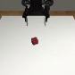
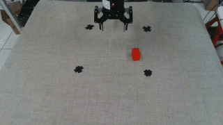
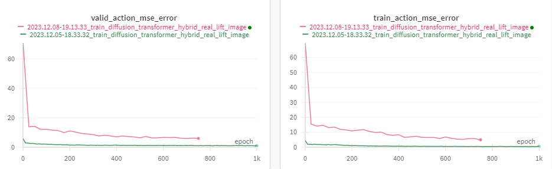
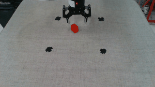
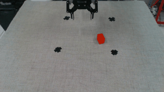
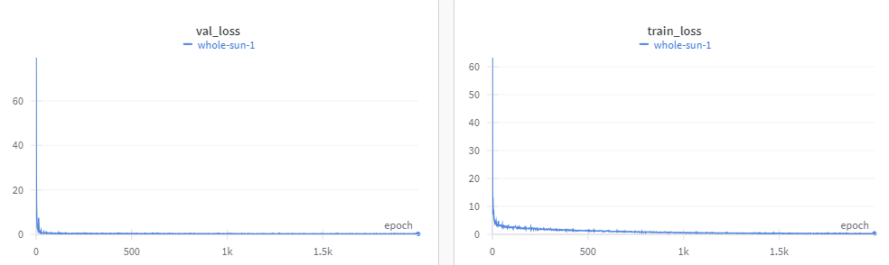
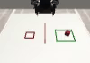
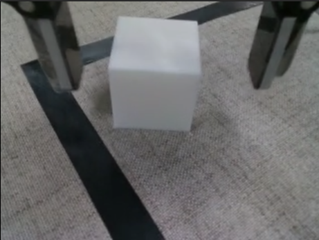
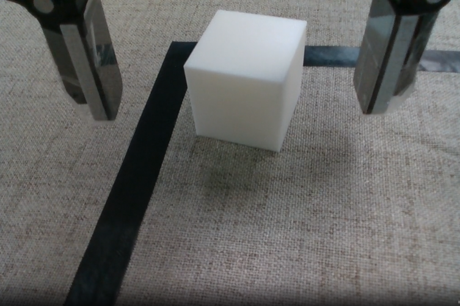

[TOC]

# 跬步千里

**Weekly Report.**

The best moments usually occur when a person's body or mind is stretched to its limits in a voluntary effort to accomplish something difficult and worthwhile.

## 2023/07/05~2023/07/12 第一周

### 概述

这周的工作主要集中在Stanford的一篇文章的上，需要对文章的一些实验进行一个复现，然后第二个就是要完全读懂文章和它对应的代码。

### 完成的任务

- 代码基本完全扫过一边，基本读懂了；花了大概两三天的时间。
- 完成了自己电脑环境的配置；大概一天
- 复现了文章提供的demo模拟实验；一个下午

### 进展和挑战

- XML物理环境构建，比较难阅读，这方面的基础比较差，需要进一步了解

- 现在思考Mujoco仿真到Issac Gym的转变

### 下周计划

- 对Learning Bimanual Manipulation这个任务的深度理解，能够提出问题，甚至是改进方法
- PowerPoint准备下周的group meeting.

## 2023/07/13 ~ 2023/07/19 第二周

### Summary

The work I focused on this week is to continue to explore the paper from Stanford. To comprehend it deeply, I read papers about BERT and DETR, whose idea is used in that paper. CLS token has a representation from the global information level, which can be used as downstream tasks. In this paper, CLS output is used as style variant, namely latent code. As for DETR, it's originally used in object detection. But here, its brief or easy structure has also great performance.

### Completed Tasks

- Understand why it uses BERT and DETR ideas to solve problems in that paper.
- Passed group meeting successfully.
- Watched RSS conference live stream replay, some paper in RL implementation.

### Challenges

- Is there any idea to improve the current performance?
- Is DETR the best structure to fit this environment?
- I still can't use Isaac Gym simulation platform to do some simulation tasks.

### Next Week Plan

- Simulate the environment that the paper said totally. Fix the camera problem, and environment issues.
- Continue reading the state-of-art papers.

## 2023/07/20 ～ 2023/07/26 第三周

### 概述

这周的工作主要集中在思考如何把代码移植到Isaac gym上面，完成了以下一些事情：1. MJCF以及URDF这两类机器人描诉语言的学习，具体而言这两种实际上都是xml描述文件，并且主要是针对于树形结构的描述，描述语言中的<font color="blue">各个变量的物理意义基本都能够理解</font>，对于MJCF/URDF文件阅读没有很大问题；2. <font color="blue">实现MJCF文件在Isaac Gym仿真环境的导入</font>，解决了一系列的奇怪的问题，认识到Mujoco和Gym的不同，Gym最好是一个actor一个actor进行仿真建模的，而Mujoco是对整个场景进行导入（对整个场景进行建模在gym中会有问题）；3. ROS的学习，学URDF的时候不可避免的要部分ROS知识，同时解决了URDF导入的小问题。

### 完成的任务

- 仿真前MJCF/URDF机器人文件的导入
- ROS的学习
- Isaac Gym的学习

### 遇到的困难

- 问题1：MJCF文件它在Isaac Gym上有一些困难：worldbody只能有一个body。 此外，它们不能同时属于父体和子体，除非父体是世界体。
  - 方案：对整个场景重新梳理树形结构，重写xml文件
- 问题2：Isaac Gym会忽略一些MJCF文件的一些物理量的设定（之后对比的时候明显发现摩擦系数有很大区别，mjcf导入的模型再有重力的条件下下垂后会不停摆动，而urdf会停下）
  - 方案：用URDF进行仿真模型文件
- 问题3：Isaac Gym貌似不支持直接在URDF中设定texture（texture路径不识别的问题）
  - 方案：Gym提供了api，需要在python文件中进行修改
- 问题4：官方URDF的夹子与原文的夹子不同，原文是3D打印的新夹子，是为了更好的执行一些精细任务
  - 方案：修改URDF文件，浪费了好多时间

### 下周任务

- 实现在Isacc gym上进行仿真

## 2023/07/27 ～ 2023/08/02 第四周

### 概述

这周考虑到任务的复杂程度，以及目标只是为了去利用isaac gym平台得到一些方针数据，所以首先考虑利用它提供的一些例子代码，我主要考虑Franka -> stack cube这个任务去收集它的observations和actions。过程中最大的困难就是isaac gym envs代码量很大，需要完全吃透整个工程的代码结构才好进行修改，目前位置基本上是<font color="blue">掌握了isaac gym进行RL的过程以及整个的代码结构</font>。

### 完成的任务

- isaacgymenvs仓库（gym仿真的包）的代码结构的理解
- 获得了fanka进行stack cube这个任务的数据（摄像头的图片、joint positions、actions），但是这个actions有很大不同

### 遇到的困难

- 问题1：isaacgymenvs进行RL的逻辑结构

​	`cfg`里面包含的是配置文件，通过hydra进行导入，这里包括task配置（env、sim），强化学习算法配置PPO，pbt是如果需要进行多gpu并行训练的时候需要添加的配置，cfg文件下还有一个config.yaml文件这个是用来进行override一些配置参数的。

​	`learning`里面包含的是强化学习算法，train设计使用的是a2c_continuous的RL算法。train是agent，test是player。

​	`pbt`它是pbt算法（Population-Based Training）

​	`tasks`任务定义，定义observation维度，action维度。它继承vec_task他的任务就是创建仿真环境，其中step很重要，它是在执行action后更新环境的函数，返回obs, rewards, resets(是否完成)，info（超时信息）

​	`train.py`利用runner进行train or test， 这里只关注players，这里面实现了get_action，使用model得到包括action等信息，players继承player，run函数是核心，在这里是信息agent和env互动的函数，在这里导出整个操作的数据。

​	buffer这些在执行过程中的一些内容信息，会在task中或者说vec_task的继承中更新。

- 问题2：obs怎么定义？
  - 方案：obs在compute_observations中实现，它实际上是直接从states中抽出来，可以进行自定义，比如说添加摄像头的handles
- 问题3：如何实现读取env或者说创建env的？
  - 方案：isaacgymenvs.make里面会调用一个map，实际上env就是自己写的task类，后面进行play的时候需要利用好env的attribution
- 问题4：step和run它们的作用分别是什么？
  - 方案：run会调用step，这是进行整个task可以这样认为；那么step就是这个task过程的一帧的update或者是物理环境在一个timestep的更新
- 问题5：franka的人物没有用到摄像头，怎样添加这个camera？
  - 方案：所谓的states并没有那么有很大的作用，RL算法使用到的数据是observations进行reward的计算，所以初步认为，image可以放在state，然后camera可以在create_sim中进行添加；

### 下周任务

- 用ACT框架跑一跑franka的任务
- 这次是修改了package源代码，可能以后会有问题，最好写出一版不要改package源代码的代码
- 实现VX300S机械臂的仿真代码


## 2023/08/03 ～ 2023/08/9 第五周

### 概述

这种的工作完成了ACT框架的修改，能够导入stack cube的task配置文件，并且实现了这个任务的train和inference步骤，为了更好的实验效果，对cube的初始位置进行了固定，以及franka的初始姿态也固定在一定范围，让它不是一个完全随机的过程。最终的结果并不是很理想，实验效果比较差。

### 完成的任务

- franka机械臂stack cube任务在ACT网络框架下的训练和测试

### 遇到的困难

- Q1: 数据纬度需要进行统一
  - S1: 人为定义一个上限 然后对所有文件进行整体padding

- Q2: isaacgymenvs.make有问题
  - S2: 项目有对hydra的依赖，如果直接进行make一个环境会有问题，按照原项目的train函数进行模仿重新写一个train和inference的函数

## 2023/08/10～2023/08/16

Diffusion Policy

## 2023/08/17～2023/08/23

Implement ACT in `DP` code frame. 

## 2023/08/24~2023/08/30

### Summary

This week, I put my focus on some comparative experiments, i.e. tasks like CAN, SQUARE and PUSH-T. Based on the tasks, I trained 3 policies, includes ACT, DP and  IBC. They are all relied on MUJOCO simulation environment. These experiments results can be found <a href="https://github.com/Dominique-Yiu/week_report/blob/master/documents/experiments.md">EXPERIMENTS.MD</a>, and because some tasks are still executing, I will replenish these missing pieces within next few days.

### Challenges

:pushpin: IBC policy has a extreme bad performance when doing the SQUARE task.

:dart: In the DP paper, it described that IBC exactly had a bad performance under SQUARE task scenario. Then, I tried Push-T scenario and got the close success rate as the paper says.

:pushpin: Confusion about how package ROBOMIMIC initializes the environment, such as the initial pose of robot, square nut pose and position, even the table settings.

:dart: <a href="https://github.com/Dominique-Yiu/week_report/blob/master/documents/experiments.md">Details</a>

### Next week targets

:round_pushpin: More exp

## 2023/08/21~2023/09/07

### Summary

This week I finished polishing my documents on IBC, DP and other algorithms. The huge work overwhelmed my, but I succeeded to overcome it. The primary goal of taking down notes of everything I encountered is to elevate my insights of these algorithms, like the algorithm procedures, the implementation and even some fundamental knowledges.

### Challenges


### Next Week Targets

Reproduce RT-1 Model

## 2023/09/08~2023/09/14

RT-1 Done!

## 2023/09/15 ~ 2023/09/26

### Summary

This half month I was trying to implement several algorithms, such RT-1, VINN, etc. However, VINN paper does not open its codes completely and RT-1 is implemented with tenserflow, which means that I need to code on these missing parts to implement them. With my deeper work on this moving on, I found my coding ability progressed drastically while I was manually creating the whole workspace. 

### Done

NEW APPROACH

- [x] MODEL
- [x] K-MEANS
- [x] POLICY
- [x] WORKSPACE
- [x] DEBUG

### Challenges


### Need to be done

RT-1, etc, they have some missing parts needed to be implemented, like `n_obs_steps/To`. *Receding Horizon*


## 2023/10/07~2023/10/19
### Summary
The long holiday resting's over. I quickly returned to work, to figure out why my code did not get a satisfying performance. The problem is, at first, I virtually changed every corner to integrate into DP code structure. So these 2 weeks I planned to change ACT code from step to step, more specifically, transformer implementation, position embedding, visual encoder, receding horizon, and finally classification. Until now, I've already done the first 2 steps, and everything worked well. The second thing is about SpaceMouse. My plan is to develop a comprehensive system, which can control all kinds of manipulators, including iiwa, franka, and UR in CoppeliaSim environment.

### Done

### Challenges

### Need to be done


## 2023/11/5 ~ 2023/11/12

### Summary

In recent days, I just finished some issues about Real Environment, in terms of multiple-process/threading, sync and robot inference.

### Challenges

**Cannot save too many images within Robot Threading.**
> This is because images processing need quite a long time, which delays the whole timeline to make actions unrecognized as new instructions. The solution is we first saved the whole process in a video, and load these data while doing training.

### TODO
Now, actually the trained model is not so good, when I used that trained model in iiwa 7, the robot always crashed. Additionally, the output or the predicted actions are randomly, maybe the model is not so well indeed?

## 2023/11/21

### 本周工作内容

- 解决下位机与上位机进行操控时的速度不一致问题

  - 设置上位机最大速度（本质上其实是控制通信频率）
  - 通过上位机最大速度/频率，对下位机SpaceMouse进行同步
  - 给SpaceMouse设置一个最低阈值，避免误触增加数据的复杂度

- 解决上位机停顿不连续问题

  - 做推断的过程在0.1s左右，意味着每一次给上位机发送指令会有一个停顿，不可避免上位机动起来断断续续
  - RealTime Servo控制不支持直接的速度控制，但我们可以在自己程序中设定一个执行持续时间
  - 最终考虑，可以降低上位机的最大速度，32mm/s -> 8mm/s

- 真机部署效果差

  - 把任务难度下降到最低，初始位置固定，目标木块位置基本固定，行径路径大致一致

  <div align="center">
      
  </div>

  - 改用DP在真实任务下（Push-T）的配置参数
  - 效果仍然比较差

  <div alilgn="center">
      
      
  </div>

- 仿真测试

  - 模拟真实环境30hz进行数据采集（20条）
  - Franka -> iiwa7, Franka gripper -> Robotiq85 gripper
  - lift cube任务
  - DP的仿真配置文件

  <div align="center">
      
  </div>

### 下下周计划

- 思考performance很差的原因
- 排除图像收集过程中的干扰因素
- 尝试更多的其他算法，看是不是数据的原因

## 2023/12/01

### 周总结

11/29日参与研讨会，有以下几个收获：

- 首先learning肯定是未来的方向，目前有两种track，一种是totally based on data，就是想GPT一样能够有足够多的数据支持，然后让模型能够做更多的任务，达到zero-shot的效果；另外一个就是，learning也应该是和人学习一样，不会说你可以凭空可以去做一个任务，还是要针对于task进行训练。（RT-1, RT-2以及RT-X，对应的CVAE, DM）
- GPT在task planning和motion planning的应用
- 也谈了一下offline RL和immitation的结合


## 2023/12/09

- 12/01采集的数据部署的效果非常差，观察到的现相：在抓物体的过程中出现怪异姿势，甚至会抱死；

  <div align="center">
      
  </div>

  - 现象分析：

    - 在预测静止动作的时候，会存在些许偏差。例子：比如预测下一时刻的末端位置，理想状态下是一个全零向量[0,0,0,0,0,0]，但是实际上可能是[0.01,-0.02,0,0.01,-0.01,0.02]。前三个度量单位是毫米，后三个单位是弧度；
    - 位置影响很小，但是由于预测的是一个连续序列动作，角度的误差最差情况下能达到好几度；
    - 当遇到一个未知的状态下，会变得非常不稳定（异常->更加异常，甚至引起抱死）；

  - 解决思路：

    - SpaceMouse在做action的捕捉的时候，过滤掉0.3以下的数据，保证采集数据是比较大的值，也是让模型训练以后能够让“真正的动作”更明显

    - 给角度设置一个阈值：

      - ```
        mask = np.logical_and(action[:, 3:6] >= -0.02, action[:, 3:6] <= 0.02)
        action[:, 3:6][mask] = 0.0
        ```

  - 最终效果：
  
    <div align="center">
        
    </div>


- 12/05重新收集50组数据。程序上限制数据的时间长度（15s），而不是之前手动停止数据收集；运动比较慢，同时大多数情况下会处于不动的状态；val_mse并没有向0进行收敛；

  <div align="center">
      
      
  </div>


  - 现象分析：

    - 在分析收集的action时，发现收集的数据基本上都有前3s多的静止不动的画面；
    - 认为可能是训练数据的action不够大；
    - 不收敛可能是因为数据量不够大；
  - 解决思路：

    - 数据收集开始避免不必要的等待；
    - 在更短的时间，以更低的频率进行数据收集
    - 收集100条轨迹数据

- 12/9部署结果（10s/5hz/100条）模型的val_mse一致在降，但其实还是一个很大的数值；

  <div align="center">
      
  </div>


  - 短距离，能够成功，但是明显可以看到会运动的过大，比如抓到之后还会向下运动：

    <div align="center">
        
    </div>

  - 长距离，不成功，明显运动过大并且不会调整回来：

    <div align="center">
        
    </div>

  -  现象分析：

    - 频率不能够太低，最好还是只是缩短servo的时间；
    - 不确定：训练用的observation有问题？模型不会用？

- 尝试使用ACT在相同数据的进行训练的部署效果->目的就是看是不是DP在当前参数下perf就是不是很好


  - 写一个data_conversion.py将DP收集数据的格式转化为ACT能使用的形式；

  - 将qpos替换成末端位置和爪子的姿态；

  - 训练效果如下：

    <div align="center">
        
    </div>

  - 目前还在修改ACT在DP框架下的部署代码；


## 2023/12/23

前两周做的事情有两个，第一是在让仿真跑起来，之前一直是仿真实验不成功，第二件事就是在仿真成功的情况下去做真机数据采集训练还有部署。

> 对于仿真, 其实在训练效果表现上非常的好, 但是之前在仿真中部署之后, 效果非常差, 和训练数据的结果严重不吻合. 但是, 在之后的的观察中, 发现实际上部署导出的视频的环境setting和柴数据的完全不一致. 接着不断排查问题, 发现是版本的差别, 于是把新版本的assets里面所有的`xml`或者其他的模型进行覆盖(这里目前有点儿不合理, 因为是直接对site-package进行更改, 后期在进行全面compatible的代码整理). 覆盖之后, 还需要对新的asset进行处理, 把识别不了的`autolimit`进行剔除. (这儿其实花了很多时间, 主要是找bug) 修改之后, 再对仿真进行部署, 发现训练的模型确实是有用的, 能够完成简单的lift任务.
>
> 对于真机, 最大的一个改动也是最有效的一个改动, 就是把欧拉角度插值改成了四元数角度的插值, 这个改动解决了一直以来的操控卡顿和加速的问题, 一个是提高了采数据的效率, 一个增加了数据的有效性. 第二, 放宽了真机采数据的限制, 不再让角度和位置控制分开操作. 这两个改动, 让现在的效果在`pick in place`任务上也是很不错的. 

**遇到的问题**

- 无论是仿真还是真机进行inference的时候, 都会发现, 会存在机器一直不动的情况

<div align="center">
  
</div>

今日任务:

- 失败原因分析
- 申请西北大学的项目

**200次PICK训练数据实验**

在仿真中做一下，不同频率(10 hz, 20 hz, 30hz)情况下对模型效果的影响

- 写插值

不收敛的原因：

- 频率
- 摄像头

<div align="center">
    
    
</div>

左图是收集的数据，可以看到和有图测试效果很相似，很难区分真正需要关闭夹爪的位置。

evaluation卡顿问题：

- 经过分析，这里卡顿是因为弄混了inference的freq和control的freq之间的概念。比方说，在我们进行采数据的时候，频率为10hz，这个频率就是control freq，每0.1秒发给机械臂一个action。但是在做evaluation的时候，会有inference freq的概念，我这里定义为：每次做一次prediction的所消耗的时间。然而，每次预测实际上是预测/执行多步（假设执行8步），那么实际上本应该的control freq将会是8 * inference_freq。但实际上我们给的control freq是10hz，这就会导致需要将一个很高的频率同步到10hz，也就意味着动作很快就做完了，但是还需要进行等待。
- 所以正确的做法是，让我们需要指定的control freq和计算的估计值inference_step * inference_freq相近（小于最好，不然会有些bug）。