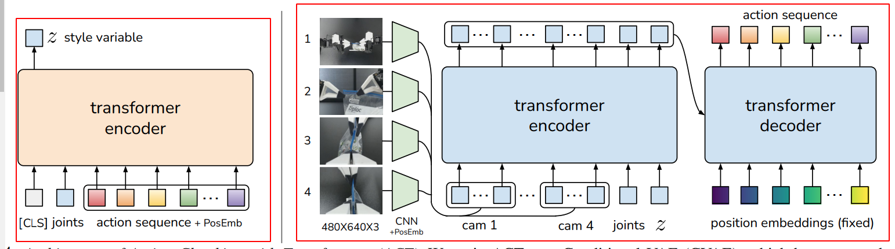
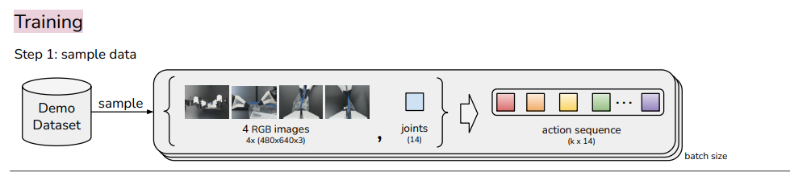
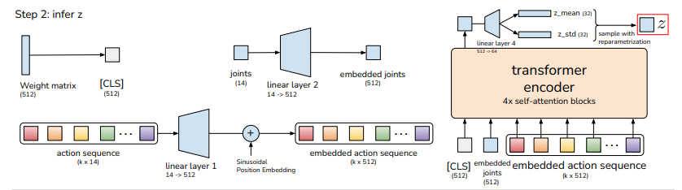
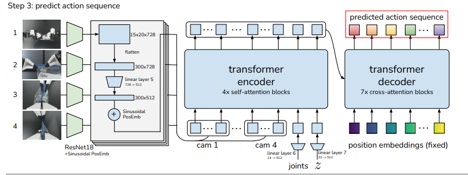
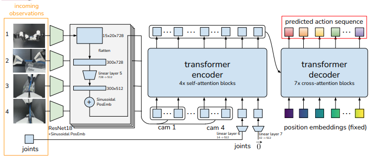

# Action Chunking with Transformers

## Training



The whole model is trained as a Conditional VAE, which means it first produces a latent code extracted from the input (called encoder, left in the picture), and then uses the latent code to restore the input (called decoder, right in the picture). In details, it regards observations as the conditions to constrain and help itself to perform better.



Before training, we should to create our `dataloader`. First, its `.dhf5` file data structure is like this below:

```tex
action: target joint positions [episode_len, 14] # each robot has 7 DoF
observations:
	- images: [episode_len, cam_num, h, w]
		- top
		- left wrist
		- right wrist
		- front
	- qpos: current joint positions [episode_len, 14]
	- qvel: current joint velocity [episode_len, 14]
```

**Sample the data:** Here it just randomly select an int from [0, episode_len], named `start_ts`. For per data sample in a batch, we just select index of `start_ts` from original data. Specifically, `dataset[observations][qpos][start_ts]` for instance, and the images as well. About action sequence, we do the follow things.

```python
# create a zero vector in action episode shape
padded_action = torch.zero_like(action)
# sample actions from action episode
sample_actions = dataset[action][start_ts:]
# replace padded_action with sample actions
padded_action[:len(sample_actions)] = sample_actions
# sample the first k actions as action sequence
action_sequence = padded_action[:k]
```

### Input

```python
# joints: joint position/torques
# action sequence: a sequence of action in order
# images: the images store image info in every single timestep from wrist, front, top cameras 
```

### CVAE Encoder



```python
## Obtain latent z from action sequence
# project action sequence to embedding dim, and concat with a CLS token
action_embed = self.encoder_action_proj(actions) # (bs, seq, hidden_dim)
qpos_embed = self.encoder_joint_proj(qpos)  # (bs, hidden_dim)
qpos_embed = torch.unsqueeze(qpos_embed, axis=1)  # (bs, 1, hidden_dim)
cls_embed = self.cls_embed.weight # (1, hidden_dim)
cls_embed = torch.unsqueeze(cls_embed, axis=0).repeat(bs, 1, 1) # (bs, 1, hidden_dim)
encoder_input = torch.cat([cls_embed, qpos_embed, action_embed], axis=1) # (bs, seq+2, hidden_dim)
encoder_input = encoder_input.permute(1, 0, 2) # (seq+2, bs, hidden_dim)
# do not mask cls token
cls_joint_is_pad = torch.full((bs, 2), False).to(qpos.device) # False: not a padding
is_pad = torch.cat([cls_joint_is_pad, is_pad], axis=1)  # (bs, seq+1)
# obtain position embedding
pos_embed = self.pos_table.clone().detach()
pos_embed = pos_embed.permute(1, 0, 2)  # (seq+1, 1, hidden_dim)
# query model
encoder_output = self.encoder(encoder_input, pos=pos_embed, src_key_padding_mask=is_pad)
encoder_output = encoder_output[0] # take cls output only
latent_info = self.latent_proj(encoder_output)
mu = latent_info[:, :self.latent_dim]
logvar = latent_info[:, self.latent_dim:]
latent_sample = reparametrize(mu, logvar)
latent_input = self.latent_out_proj(latent_sample)
```

> It will concatenate embedded CLS (bs, 1, dim), embedded joint positions (bs, 1 , dim), and action sequence (bs, horizon, dim) which has time history information.
>
> Here, in each transformer encoder layer, it will do one time position embedding, which is a big difference from pytorch package. (Here position embedding is not learnable)

### Visual Encoder

Here visual encoder is from torchvision.models.resnet18, but it did some modification, like replacingnorm_layer with his own designed FrozenBatchNorm2d. More importantly, instead of taking the last output of Linear Layer, it uses {'layer4': "0"}.

```python
class BackboneBase(nn.Module):

    def __init__(self, backbone: nn.Module, train_backbone: bool, num_channels: int, return_interm_layers: bool):
        super().__init__()
        # for name, parameter in backbone.named_parameters(): # only train later layers # TODO do we want this?
        #     if not train_backbone or 'layer2' not in name and 'layer3' not in name and 'layer4' not in name:
        #         parameter.requires_grad_(False)
        if return_interm_layers:
            return_layers = {"layer1": "0", "layer2": "1", "layer3": "2", "layer4": "3"}
        else:
            return_layers = {'layer4': "0"}
        self.body = IntermediateLayerGetter(backbone, return_layers=return_layers)
        self.num_channels = num_channels

    def forward(self, tensor):
        xs = self.body(tensor)
        return xs

class Backbone(BackboneBase):
    """ResNet backbone with frozen BatchNorm."""
    def __init__(self, name: str,
                 train_backbone: bool,
                 return_interm_layers: bool,
                 dilation: bool):
        backbone = getattr(torchvision.models, name)(
            replace_stride_with_dilation=[False, False, dilation],
            pretrained=is_main_process(), norm_layer=FrozenBatchNorm2d) # pretrained # TODO do we want frozen batch_norm??
        num_channels = 512 if name in ('resnet18', 'resnet34') else 2048
        super().__init__(backbone, train_backbone, num_channels, return_interm_layers)
```

### CVAE Decoder

The `decoder` includes a resnet block to process images, a transformer encoder and a transformer decoder. The inputs include images from four different cameras, joints positions and latent code/style variable from `encoder` of VAE. For images, it will go into ResNet18 to extract its features. Then the features of images, joints positions and style variable will be concatenated together for position embedding. 



The inputs of transformer decoder are also some learnable embedding parameters which teaches the model how to query actions.

```python
# Image observation features and position embeddings
all_cam_features = []
all_cam_pos = []
for cam_id, cam_name in enumerate(self.camera_names):

    features, pos = self.backbones[0](image[:, cam_id]) # HARDCODED
    features = features[0] # take the last layer feature
    pos = pos[0]
    all_cam_features.append(self.input_proj(features))
    all_cam_pos.append(pos)
# proprioception features
proprio_input = self.input_proj_robot_state(qpos)
# fold camera dimension into width dimension
src = torch.cat(all_cam_features, axis=3)
pos = torch.cat(all_cam_pos, axis=3)
hs = self.transformer(src, None, self.query_embed.weight, pos, latent_input, proprio_input, self.additional_pos_embed.weight)[0]
```

> It selects the output of {'layer4': "0"} (transfer shape: 3, h, w into shape: dim, h’, w’) to represent images features, whose shape is (bs. dim, cam_num * h’ * w’). And its position information is based on the relative position of (h’, w’). (not learnable)
>
> Secondly, it changes a part of resnet18, which uses FrozenBatchNorm2d to replace all NormLayers.

```python
# transformer decoder forward
q = k = self.with_pos_embed(tgt, query_pos)
tgt2 = self.self_attn(q, k, value=tgt, attn_mask=tgt_mask,
                      key_padding_mask=tgt_key_padding_mask)[0]
tgt = tgt + self.dropout1(tgt2)
tgt = self.norm1(tgt)
tgt2 = self.multihead_attn(query=self.with_pos_embed(tgt, query_pos),
                           key=self.with_pos_embed(memory, pos),
                           value=memory, attn_mask=memory_mask,
                           key_padding_mask=memory_key_padding_mask)[0]
```


> **Encoder**
>
> In transformer encoder, it concatenates images features (bs, cam_num * h * 2, dim), joints positions (bs, 1, dim) and latent code (bs, 1, dim). And do position embedding in each encoder layer. (Here one part of position embedding is from Visual Encoder, another is nn.Embedding.weights).
>
> **Decoder**
>
> The input (namely queries) are learnable parameters. In every decoder layer, it would not just embed during self-attention, but also embed in multi-head attention.

### Loss Function

The total loss contains l1_loss/MAE and kl divergence. l1_loss is got by calculating the difference between predict_actions and original actions. kl divergence is calculated with mean and variance.

```python
def __call__(self, qpos, image, actions=None, is_pad=None):
    env_state = None
    normalize = transforms.Normalize(mean=[0.485, 0.456, 0.406],
                                     std=[0.229, 0.224, 0.225])
    image = normalize(image)
    if actions is not None: # training time
        actions = actions[:, :self.model.num_queries]
        is_pad = is_pad[:, :self.model.num_queries]

        a_hat, is_pad_hat, (mu, logvar) = self.model(qpos, image, env_state, actions, is_pad)
        total_kld, dim_wise_kld, mean_kld = kl_divergence(mu, logvar)
        loss_dict = dict()
        all_l1 = F.l1_loss(actions, a_hat, reduction='none')
        l1 = (all_l1 * ~is_pad.unsqueeze(-1)).mean()
        loss_dict['l1'] = l1
        loss_dict['kl'] = total_kld[0]
        loss_dict['loss'] = loss_dict['l1'] + loss_dict['kl'] * self.kl_weight
        return loss_dict
    else: # inference time
        import ipdb
        # ipdb.set_trace()
        a_hat, _, (_, _) = self.model(qpos, image, env_state) # no action, sample from prior
        return a_hat
```


## Inference

When doing testing, `Encoder` will be discarded and z is simply set to the mean of the prior (i.e. zero) at test time.



```python
""" set latent input """
mu = logvar = None
latent_sample = torch.zeros([bs, self.latent_dim], dtype=torch.float32).to(qpos.device)
latent_input = self.latent_out_proj(latent_sample)
```

In testing time, policy will return actions instead of loss_dict (can be seen in Loss Function section).

## Code Structure

Code structure here is pretty easy, but when you need to modify something, it becomes not so convenient.

```bash
.
├── assets
├── data_dir
├── detr
├── constants.py
├── utils.py
├── ee_sim_env.py
├── sim_env.py
├── policy.py
├── scripted_policy.py
├── imitate_episodes.py
├── record_sim_episodes.py
└── visualize_episodes.py
```

`assets` saves the robot physical modle(xml file) and various environments in different tasks.
`data_dir` saves traning data.
`detr` is the transformer model file, defines the model structure.
`utils` defines some common used functions.
`ee_sim_env/sim_env` respectively defines EEF-control and Joint-Pos control space in Mujoco Env.
`scripted_policy` is a hand-made policy to lead the robot how to complete the task.
`policy` is a policy used detr model.
`imitate_episodes` defines how it train and evaluate the whole model.
`record_sim_episodes` is to produce simulation data.
`visualize_episodes` is a method to save the simulation video.  
