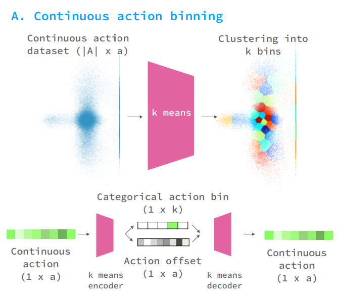
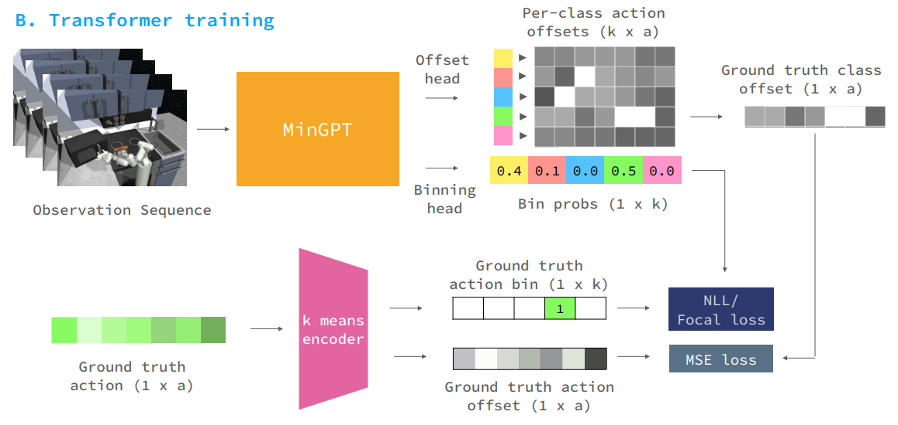
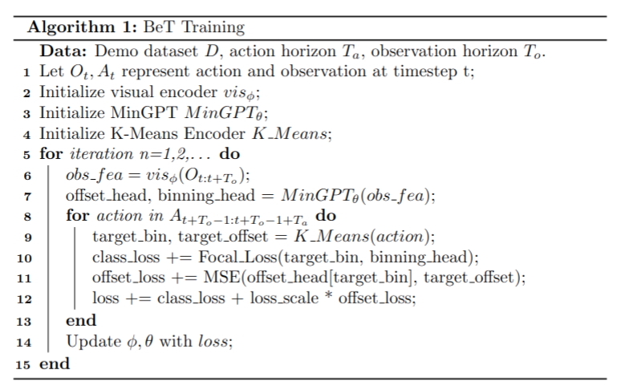
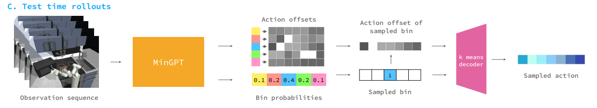
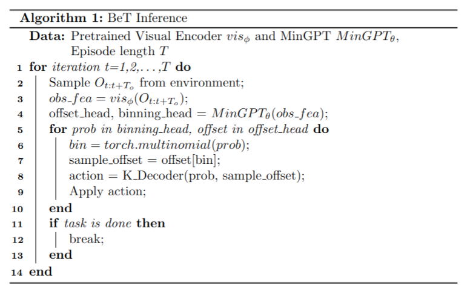

# Behavioral Transformer

Considered that modeling multi-modality distribution of high-dimension continuous values is a quilt challenging problem, here proposes a new factoring of the action prediction task by dividing each action in two parts: a categorical variable denoting a `action center` and a corresponding `residual action`.

<div align='center'>
    
</div>


Given the continuous action dataset, we first optimize for a set of $k$ action centers, $\{A_1,A_2,\dots,A_k\}\in A$. 

The whole process can be decomposed into 2 parts: a categorical variable representing the closest center bin, and a continuous residual action. Finally, we can deterministically reconstruct the true action based on these 2 parts.

**K-Means Encoder**

Input:

- action: an action at a specific timestep [1, act_dim]

Output:

- categorical action bin: a k-length probability array corresponding k action centers [1, k]
- action offset: action offset from its corresponding action center [1, act_dim]

1. Calculate the closest bin for every single action.
2. Obtain offsets by `input_action - bin_action`

**K-Means Decoder**

Input:

- categorical action bin: a k-length probability array corresponding k action centers [1, k]
- action offset: action offset from its corresponding action center [1, act_dim]

Output:

- action: an action at a specific timestep [1, act_dim]

1. Get action bin with categorical action bin
2. Get action by `offset + bin_action`

## Training

<div align='center'>
    
</div>

**Input (MinGPT):**

- Observation Sequence: a continuous history of observations $(O_i,O_{i+1},\dots,O_{i+h-1})$ Dict

> Here observation sequence would be first sent to Visual Encoder like DP described. So actually the input of MinGPT is features of a history of observation sequence.

**Output (MinGPT):**

- Binning head: Bin probability array [batch_size, horizon, k]
- Offset head: Per-class action offsets [batch_size, horizon, k, act_dim]

**Input (K-Means Encoder):**

- Ground truth action: [batch_size, horizon, act_dim]

**Output (K-Means Encoder):**

- Ground truth action bin: true action probability array [batch_size, horizon, k]
- Ground truth action offsets: true action offsets [batch_size, horizon, act_dim]

Under the above two module processing the input data, we get `binning head`, `offset head` from MinGPT and `truth action bin`, `truth action offset` from k-means encoder. Then we calculate the training loss to backward to update model parameters $\theta$. The loss can be decomposed into 2 parts: Focal loss (action bin probs loss) and MSE loss (action offset loss).

**Focal Loss**

$$FL(y, p) = -\sum^{N}{\sum_{i=1}^k y_i (1-p_i)^\gamma \log p_i}$$

$y_i$ here denotes ground truth action bin at index i. $p_i$ denotes binning head at index i. N denotes batch size. $\gamma$ is a preset hyperparameter.

**MSE Loss**

In order to get the ground truth class offset in the top-right corner, we use `ground truth action bin` as index to select the corresponding offsets, i.e. ground truth class offset.

$$MSE = \frac{1}{k*N}\sum^N {\sum_{i=1}^k (y_i - \hat{y}_i)^2}$$

<div align='center'>
    
</div>

> **Algorithm:** BeT Training
>
> **Data:** Demo dadtaset $D$, horizon $T$, observation horizon $T_o$.
>
> Let $O_t,A_t$ represent action and observation at time step t;
>
> Initialize Visual Encoder $vis_{\phi}$;
>
> Initialize MinGPT $MinGPT_{\theta}$;
>
> Initialize K-Means Encoder $K\_Encoder$;
>
> **for** $interation n=1,2,\dots$ **do**
>
> ​	obs_fea = $vis_{\phi}(O_{t:t+T_o})$;
>
> ​	offset_head, binning_head = $MinGPT_{\theta}(obs\_fea)$;
>
> ​	**for** action **in** $A_{t:t+T}$ **do**
>
> ​		target_bin, target_offset = $K\_Encoder(action)$;
>
> ​		class_loss += Focal_Loss(target_bin, binning_head);
>
> ​		offset_loss += MSE(offset_head[target_bin], target_offset);
>
> ​		loss += class_loss + loss_scale * offset_loss;
>
> ​	**end**
>
> ​	Update $\phi,\theta$ with loss;
>
> **end**


```python
# diffusion_policy/model/bet/latent_generators/mingpt.py
def get_latent_and_loss(
    self,
    obs_rep: torch.Tensor,
    target_latents: torch.Tensor,
    seq_masks: Optional[torch.Tensor] = None,
    return_loss_components: bool = False,
) -> Tuple[torch.Tensor, torch.Tensor]:
    # Unlike torch.transformers, GPT takes in batch x seq_len x embd_dim
    # obs_rep = einops.rearrange(obs_rep, "seq batch embed -> batch seq embed")
    # target_latents = einops.rearrange(
    #     target_latents, "seq batch embed -> batch seq embed"
    # )
    # While this has been trained autoregressively,
    # there is no reason why it needs to be so.
    # We can just use the observation as the input and the next latent as the target.
    if self.predict_offsets:
        target_latents, target_offsets = target_latents
    is_soft_target = (target_latents.shape[-1] == self.vocab_size) and (
        self.vocab_size != 1
    )
    if is_soft_target:
        target_latents = target_latents.view(-1, target_latents.size(-1))
        criterion = soft_cross_entropy
    else:
        target_latents = target_latents.view(-1)
        if self.vocab_size == 1:
            # unify k-means (target_class == 0) and GMM (target_prob == 1)
            target_latents = torch.zeros_like(target_latents)
        criterion = FocalLoss(gamma=self.focal_loss_gamma)
    if self.predict_offsets:
        output, _ = self.model(obs_rep)
        logits = output[:, :, : self.vocab_size]
        offsets = output[:, :, self.vocab_size :]
        batch = logits.shape[0]
        seq = logits.shape[1]
        offsets = einops.rearrange(
            offsets,
            "N T (V A) -> (N T) V A",  # N = batch, T = seq
            V=self.vocab_size,
            A=self.action_dim,
        )
        # calculate (optionally soft) cross entropy and offset losses
        class_loss = criterion(logits.view(-1, logits.size(-1)), target_latents)
        # offset loss is only calculated on the target class
        # if soft targets, argmax is considered the target class
        selected_offsets = offsets[
            torch.arange(offsets.size(0)),
            target_latents.argmax(dim=-1).view(-1)
            if is_soft_target
            else target_latents.view(-1),
        ]
        offset_loss = self.offset_loss_scale * F.mse_loss(
            selected_offsets, target_offsets.view(-1, self.action_dim)
        )
        loss = offset_loss + class_loss
        logits = einops.rearrange(logits, "batch seq classes -> seq batch classes")
        offsets = einops.rearrange(
            offsets,
            "(N T) V A -> T N V A",  # ? N, T order? Anyway does not affect loss and training (might affect visualization)
            N=batch,
            T=seq,
        )
        if return_loss_components:
            return (
                (logits, offsets),
                loss,
                {"offset": offset_loss, "class": class_loss, "total": loss},
            )
        else:
            return (logits, offsets), loss
    else:
        logits, _ = self.model(obs_rep)
        loss = criterion(logits.view(-1, logits.size(-1)), target_latents)
        logits = einops.rearrange(
            logits, "batch seq classes -> seq batch classes"
        )  # ? N, T order? Anyway does not affect loss and training (might affect visualization)
        if return_loss_components:
            return logits, loss, {"class": loss, "total": loss}
        else:
            return logits, loss
```


## Inference

<div align="center">
    
</div>

Procedures:

1. Transform Observation Sequence into obs features.
2. Utilize MinGPT to generate Bin probs and Action offsets.
3. Based on Bin probs, we sample a bin.
4. Use the index to sample action offset.
5. Generate action based on sampled bin and sample offset with K-Means Decoder.

<div align="center">
    
</div>
> **Algorithm:** BeT Inference
>
> **Data:** Pretrained  $vis_{\phi}$ and $MinGPT_{\theta}$, episode length $L$.
>
> **for** $iteration t=1,2,\dots, L$ **do**
>
> ​	Sample $O_{t:t+T_o}$ from environment;
>
> ​	$obs_fea=vis_{\phi}(O_{t:t+T_o})$;
>
> ​	offset_head, binning_head = $MinGPT(obs_fea)$;
>
> ​	**for** prob **in** binning_head, offset **in** offset_head **do**
>
> ​		bin = torch.multinomial(prob);
>
> ​		sample_offset = offset[bin]
>
> ​		action = K_Decoder(prob, sample_offset);
>
> ​		Apply action;
>
> ​	**end**
>
> ​	**if** task is done **then**
>
> ​		break;
>
> ​	**end**
>
> **end**


```python
def predict_action(self, obs_dict: Dict[str, torch.Tensor]) -> Dict[str, torch.Tensor]:
    """
    obs_dict: must include "obs" key
    result: must include "action" key
    """
    assert 'past_action' not in obs_dict # not implemented yet
    try:
        nobs = self.normalizer.normalize(obs_dict)
    except Exception as e:
        import ipdb; ipdb.set_trace()
    
    value = next(iter(nobs.values()))
    B, To = value.shape[:2]
    T = self.horizon
    Da = self.action_dim
    Do = self.obs_feature_dim
    To = self.n_obs_steps

    # build input
    device = self.device
    dtype = self.dtype
    
    this_nobs = dict_apply(nobs, lambda x: x[:,:To,...].reshape(-1,*x.shape[2:]))
    nobs_features = self.obs_encoding_net(this_nobs)
    # reshape back
    enc_obs = nobs_features.reshape(B, To, -1)

    # Sample latents from the prior
    latents, offsets = self.state_prior.generate_latents(enc_obs)

    # un-descritize
    naction_pred = self.action_ae.decode_actions(
        latent_action_batch=(latents, offsets)
    )
    # (B,T,Da)

    # un-normalize
    action_pred = self.normalizer['action'].unnormalize(naction_pred)

    # get action
    start = To - 1
    end = start + self.n_action_steps
    action = action_pred[:,start:end]
    result = {
        'action': action,
        'action_pred': action_pred
    }
    return result
```

