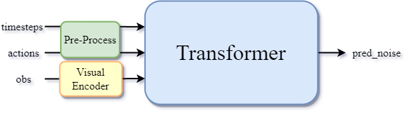
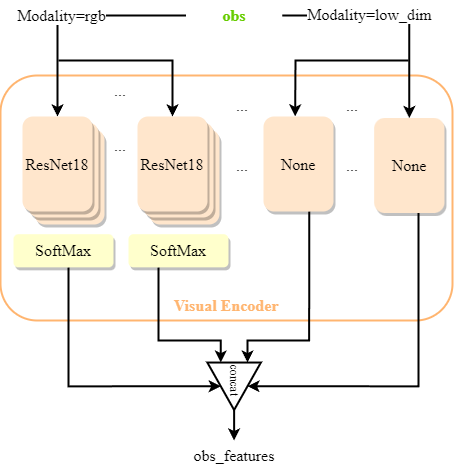
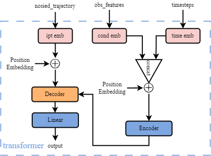

# Diffusion Policy

## Data

### Observation

- Image of the top-down camera (84, 84, 3)
- Image of the wrist camera (84, 84, 3)
- End effector's position and orientation (3, 4)
- Gripper's position (2)

### Action

- Desired translation of EEF (3)
- Desired rotation change from current EEF (3)
- Opening or closing of the gripper fingers (1)

## Network Structure

<div align="center">
    <figure id="network structure">
        
    </figure>
</div>

The noise prediction network $\epsilon_\theta(O_t, A_t ,k)$ mainly includes 3 components: <a href="#pre-process">Pre-Process</a>, <a href="#visual encoder">Visual Encoder</a> and <a href="#transformer">Transformer</a>.

**Input**

- timesteps: diffusion step (1)
- actions: action sequence (batch_size, horizon, 7)
- obs: observations

**Output**

- pred_noise: Expected noise at timestep `timesteps` given `obs` (batch_size, horizon, 7)

### <span id="pre-process">Pre-Process</span>

**Input**

- timesteps
- actions

**Output**

- <span id="expanded ts">expanded timesteps</span>: unified in dimension timestep (batch_size)
- <span id="noised action">noised actions</span>: actions with random noise (batch_size, horizon, 7)

**Details**

The pre-processing includes normalization, expanding timesteps in dimension and adding noise into actions. `num_train_timesteps` here is a hyperparameter.

**Add Noise**

$x_t=\sqrt{\overline{\alpha_t}}x_0+\sqrt{1-\overline{\alpha_t}}\epsilon$

$x_0$ is the original sample, $\epsilon$ is the noise. $\beta_t $ is the forward process variances of timestep $t$. And it has $\alpha_t=1-\beta_t$. So the add_noise function can be displayed below.

```python
def add_noise(original_samples, noise, timesteps):
    sqrt_alpha_prod = alphas_cumprod[timesteps] ** 0.5
    sqrt_one_minus_alpha_prod = (1 - alphas_cumprod[timesteps]) ** 0.5
    
    noise_samples = sqrt_alpha_prod * original_samples + sqrt_one_minus_alpha_prod * noise
    return noise_samples
```

The adding noise process can be computed through the formula below.

```python
# diffusion_policy/policy/diffusion_transformer_hybrid_image_policy.py
class DiffusionTransformerHybridImagePolicy(BaseImagePolicy):
    # ......
    def compute_loss(self, batch):
        # normalize input
        assert 'valid_mask' not in batch
		# ......
        nactions = self.normalizer['action'].normalize(batch['action'])
        batch_size = nactions.shape[0]
        horizon = nactions.shape[1]
        
		# ......

        # Sample noise that we'll add to the images
        noise = torch.randn(trajectory.shape, device=trajectory.device)
        bsz = trajectory.shape[0]
        # Sample a random timestep for each image
        timesteps = torch.randint(
            0, self.noise_scheduler.config.num_train_timesteps, 
            (bsz,), device=trajectory.device
        ).long()
        # Add noise to the clean images according to the noise magnitude at each timestep
        # (this is the forward diffusion process)
        noisy_trajectory = self.noise_scheduler.add_noise(
            trajectory, noise, timesteps)
        # ......
	# ......
```

### <span id="visual encoder">Visual Encoder</span>

**INPUTs**

- obs

  - definition: observations

  - shape: see above

  - type: dict

**OUTPUTs**

- <span id="obs_features">obs_features</span>

  - definition: features extracted from observations
  - shape: [batch_size, 137]
  - type: tensor

<div align="center">
    <figure id="visual_image">
        
        <figcaption>Visual Encoder</figcaption>
    </figure>
</div>


As shown in the picture, for the specific tasks (square and can), the `obs` modality only has 2 types, i.e. rgb and low_dim. For the rgb type, like `agentview_image` and `robot0_eye_in_hand_image`, its network is assigned a ResNet18 network. However, as for low_dim type, it would not be assigned any network, which means that the low_dim type observations would not change at all even though they are processed by Visual Encoder.

Here is one table to describe the details of these different networks. `CropRondomizer` is designed to crop the original into preset shape (here is [76, 76]). And the Visual Encoder output can be obtained through concatenating all the output of multiple networks, i.e. [batch_size, 64+64+3+4+2] -> [batch_size, 137]

| Name\|shape\|type                          | Randomizer     | Network\|IPT\|OPT           |
| ------------------------------------------ | -------------- | --------------------------- |
| agentview_image\|[3, 84, 84]\|rgb          | CropRandomizer | ResNet18\|[3, 76, 76]\|[64] |
| robot0_eye_in_hand_image\|[3, 84, 84]\|rgb | CropRandomizer | ResNet18\|[3, 76, 76]\|[64] |
| robot0_eef_pos\|[3]\|low_dim               | None           | None\|[3]\|[3]              |
| robot0_eef_quat\|[4]\|low_dim              | None           | None\|[4]\|[4]              |
| robot0_gripper_qpos\|[2]\|low_dim          | None           | None\|[2]\|[2]              |

The Visual Encoder is not pre-trained model, it will be train with transformer at the same time.

**Visual Encoder Forward Details**

```python
# /home/shawn/mambaforge/envs/robodiff/lib/python3.9/site-packages/robomimic/models/obs_nets.py
class ObservationEncoder(nn.Module):
    # ......
    def forward(self, obs_dict):
        """
        Processes modalities according to the ordering in @self.obs_shapes. For each
        modality, it is processed with a randomizer (if present), an encoder
        network (if present), and again with the randomizer (if present), flattened,
        and then concatenated with the other processed modalities.

        Args:
            obs_dict (OrderedDict): dictionary that maps modalities to torch.Tensor
                batches that agree with @self.obs_shapes. All modalities in
                @self.obs_shapes must be present, but additional modalities
                can also be present.

        Returns:
            feats (torch.Tensor): flat features of shape [B, D]
        """
        assert self._locked, "ObservationEncoder: @make has not been called yet"

        # ensure all modalities that the encoder handles are present
        assert set(self.obs_shapes.keys()).issubset(obs_dict), "ObservationEncoder: {} does not contain all modalities {}".format(
            list(obs_dict.keys()), list(self.obs_shapes.keys())
        )

        # process modalities by order given by @self.obs_shapes
        feats = []
        for k in self.obs_shapes:
            x = obs_dict[k]
            # maybe process encoder input with randomizer
            if self.obs_randomizers[k] is not None:
                x = self.obs_randomizers[k].forward_in(x)
            # maybe process with obs net
            if self.obs_nets[k] is not None:
                x = self.obs_nets[k](x)
                if self.activation is not None:
                    x = self.activation(x)
            # maybe process encoder output with randomizer
            if self.obs_randomizers[k] is not None:
                x = self.obs_randomizers[k].forward_out(x)
            # flatten to [B, D]
            x = TensorUtils.flatten(x, begin_axis=1)
            feats.append(x)

        # concatenate all features together
        return torch.cat(feats, dim=-1)
```

### Transformer 

**INPUTs**

- noised_trajectory
  - definition: noised actions from <a href="#noised action">outputs</a> of Pre-Processing
  - shape: [batch_size, horizon, 7]
  - type: tensor

- obs_features
  - definition: observation features from <a href="#obs_features">outputs</a> of Visual Encoder
  - shape: [batch_size, 137]
  - type: tensor
- timesteps
  - definition: unified in dimension timestep from <a href="#expanded ts">outputs</a> of Pre-Processing
  - shape: [batch_size]
  - type: tensor


**OUTPUT**

- pred_noise
  - definition: Expected noise at timestep `timesteps` given `obs`
  - shape: [batch_size, horizon, 7]
  - type: tensor

<div align="center">
    <figure>
    	
        <figcaption>Transformer Network</figcaption>
    </figure>
</div>

`Encoder` is designed to  encode observation features and timesteps. `n_cond_layers` is a hyperparameter that can be set in configuration files, and if it’s > 0, the transformer encoder will replace MLP encoder. 

`Decoder` takes in noised actions and encoded information, then predicts a noise with the same shape of sample as output.

Both transformer encoder and decoder are using torch.nn module, and the transformer forward computation is shown in the code box below.

> Its structure is based on minGPT, which is decoder-only. Here it means that the input `sample` (noised actions) will only being processed by the transformer decoder, which means that it does not need to learning information from `sample` by encoder, conversely it just needs to do the noise prediction task by decoder. Details are below, encoder is to process `cond` and `timestep` only, and decoder is to process `sample` only.

**Transformer Forward Details**

```python
# diffusion_policy/model/diffusion/transformer_for_diffusion.py
class TransformerForDiffusion(ModuleAttrMixin):
    # ......
    def forward(self, 
        sample: torch.Tensor, 
        timestep: Union[torch.Tensor, float, int], 
        cond: Optional[torch.Tensor]=None, **kwargs):
        """
        x: (B,T,input_dim)
        timestep: (B,) or int, diffusion step
        cond: (B,T',cond_dim)
        output: (B,T,input_dim)
        """
        # 1. time
        timesteps = timestep
        if not torch.is_tensor(timesteps):
            # TODO: this requires sync between CPU and GPU. So try to pass timesteps as tensors if you can
            timesteps = torch.tensor([timesteps], dtype=torch.long, device=sample.device)
        elif torch.is_tensor(timesteps) and len(timesteps.shape) == 0:
            timesteps = timesteps[None].to(sample.device)
        # broadcast to batch dimension in a way that's compatible with ONNX/Core ML
        timesteps = timesteps.expand(sample.shape[0])
        time_emb = self.time_emb(timesteps).unsqueeze(1)
        # (B,1,n_emb)

        # process input
        input_emb = self.input_emb(sample)

        if self.encoder_only:
            # BERT
            token_embeddings = torch.cat([time_emb, input_emb], dim=1)
            t = token_embeddings.shape[1]
            position_embeddings = self.pos_emb[
                :, :t, :
            ]  # each position maps to a (learnable) vector
            x = self.drop(token_embeddings + position_embeddings)
            # (B,T+1,n_emb)
            x = self.encoder(src=x, mask=self.mask)
            # (B,T+1,n_emb)
            x = x[:,1:,:]
            # (B,T,n_emb)
        else:
            # encoder
            cond_embeddings = time_emb
            if self.obs_as_cond:
                cond_obs_emb = self.cond_obs_emb(cond)
                # (B,To,n_emb)
                cond_embeddings = torch.cat([cond_embeddings, cond_obs_emb], dim=1)
            tc = cond_embeddings.shape[1]
            position_embeddings = self.cond_pos_emb[
                :, :tc, :
            ]  # each position maps to a (learnable) vector
            x = self.drop(cond_embeddings + position_embeddings)
            x = self.encoder(x)
            memory = x
            # (B,T_cond,n_emb)
            
            # decoder
            token_embeddings = input_emb
            t = token_embeddings.shape[1]
            position_embeddings = self.pos_emb[
                :, :t, :
            ]  # each position maps to a (learnable) vector
            x = self.drop(token_embeddings + position_embeddings)
            # (B,T,n_emb)
            x = self.decoder(
                tgt=x,
                memory=memory,
                tgt_mask=self.mask,
                memory_mask=self.memory_mask
            )
            # (B,T,n_emb)
        
        # head
        x = self.ln_f(x)
        x = self.head(x)
        # (B,T,n_out)
        return x
```

## Training

The training procedures are described in above images.

The training loss is below, the goal is to train a policy $\epsilon_{\theta}$ to predict noise accurately:

$Loss = MSE(\epsilon^k, \epsilon_{\theta}(O_t, A_t^0+\epsilon^k,k))$

where $\epsilon^k$ is a random noise with appropriate variance for iteration k. $O_t$ is the observation features.

After predicting noise by transformer, we got `pred_noise`. Then we use it to calculate training loss with the formula above. 

```python
# diffusion_policy/workspace/train_diffusion_transformer_hybrid_workspace.py
class TrainDiffusionTransformerHybridWorkspace(BaseWorkspace):
    include_keys = ['global_step', 'epoch']

    def __init__(self, cfg: OmegaConf, output_dir=None):
        super().__init__(cfg, output_dir=output_dir)

        # set seed
        seed = cfg.training.seed
        torch.manual_seed(seed)
        np.random.seed(seed)
        random.seed(seed)

        # configure model
        self.model: DiffusionTransformerHybridImagePolicy = hydra.utils.instantiate(cfg.policy)

        self.ema_model: DiffusionTransformerHybridImagePolicy = None
        if cfg.training.use_ema:
            self.ema_model = copy.deepcopy(self.model)

        # configure training state
        self.optimizer = self.model.get_optimizer(**cfg.optimizer)

        # configure training state
        self.global_step = 0
        self.epoch = 0

    def run(self):
        cfg = copy.deepcopy(self.cfg)

        # resume training
        if cfg.training.resume:
            lastest_ckpt_path = self.get_checkpoint_path()
            if lastest_ckpt_path.is_file():
                print(f"Resuming from checkpoint {lastest_ckpt_path}")
                self.load_checkpoint(path=lastest_ckpt_path)

        # configure dataset
        dataset: BaseImageDataset
        dataset = hydra.utils.instantiate(cfg.task.dataset)
        assert isinstance(dataset, BaseImageDataset)
        train_dataloader = DataLoader(dataset, **cfg.dataloader)
        normalizer = dataset.get_normalizer()

        # configure validation dataset
        val_dataset = dataset.get_validation_dataset()
        val_dataloader = DataLoader(val_dataset, **cfg.val_dataloader)

        self.model.set_normalizer(normalizer)
        if cfg.training.use_ema:
            self.ema_model.set_normalizer(normalizer)

        # configure lr scheduler
        lr_scheduler = get_scheduler(
            cfg.training.lr_scheduler,
            optimizer=self.optimizer,
            num_warmup_steps=cfg.training.lr_warmup_steps,
            num_training_steps=(
                len(train_dataloader) * cfg.training.num_epochs) \
                    // cfg.training.gradient_accumulate_every,
            # pytorch assumes stepping LRScheduler every epoch
            # however huggingface diffusers steps it every batch
            last_epoch=self.global_step-1
        )

        # configure ema
        ema: EMAModel = None
        if cfg.training.use_ema:
            ema = hydra.utils.instantiate(
                cfg.ema,
                model=self.ema_model)

        # configure env
        env_runner: BaseImageRunner
        env_runner = hydra.utils.instantiate(
            cfg.task.env_runner,
            output_dir=self.output_dir)
        assert isinstance(env_runner, BaseImageRunner)

        # configure logging
        wandb_run = wandb.init(
            dir=str(self.output_dir),
            config=OmegaConf.to_container(cfg, resolve=True),
            **cfg.logging
        )
        wandb.config.update(
            {
                "output_dir": self.output_dir,
            }
        )

        # configure checkpoint
        topk_manager = TopKCheckpointManager(
            save_dir=os.path.join(self.output_dir, 'checkpoints'),
            **cfg.checkpoint.topk
        )

        # device transfer
        device = torch.device(cfg.training.device)
        self.model.to(device)
        if self.ema_model is not None:
            self.ema_model.to(device)
        optimizer_to(self.optimizer, device)
        
        # save batch for sampling
        train_sampling_batch = None

        if cfg.training.debug:
            cfg.training.num_epochs = 2
            cfg.training.max_train_steps = 3
            cfg.training.max_val_steps = 3
            cfg.training.rollout_every = 1
            cfg.training.checkpoint_every = 1
            cfg.training.val_every = 1
            cfg.training.sample_every = 1

        # training loop
        log_path = os.path.join(self.output_dir, 'logs.json.txt')
        with JsonLogger(log_path) as json_logger:
            for local_epoch_idx in range(cfg.training.num_epochs):
                step_log = dict()
                # ========= train for this epoch ==========
                train_losses = list()
                with tqdm.tqdm(train_dataloader, desc=f"Training epoch {self.epoch}", 
                        leave=False, mininterval=cfg.training.tqdm_interval_sec) as tepoch:
                    for batch_idx, batch in enumerate(tepoch):
                        # device transfer
                        batch = dict_apply(batch, lambda x: x.to(device, non_blocking=True))
                        if train_sampling_batch is None:
                            train_sampling_batch = batch

                        # compute loss
                        raw_loss = self.model.compute_loss(batch)
                        loss = raw_loss / cfg.training.gradient_accumulate_every
                        loss.backward()

                        # step optimizer
                        if self.global_step % cfg.training.gradient_accumulate_every == 0:
                            self.optimizer.step()
                            self.optimizer.zero_grad()
                            lr_scheduler.step()
                        
                        # update ema
                        if cfg.training.use_ema:
                            ema.step(self.model)

                        # logging
                        raw_loss_cpu = raw_loss.item()
                        tepoch.set_postfix(loss=raw_loss_cpu, refresh=False)
                        train_losses.append(raw_loss_cpu)
                        step_log = {
                            'train_loss': raw_loss_cpu,
                            'global_step': self.global_step,
                            'epoch': self.epoch,
                            'lr': lr_scheduler.get_last_lr()[0]
                        }

                        is_last_batch = (batch_idx == (len(train_dataloader)-1))
                        if not is_last_batch:
                            # log of last step is combined with validation and rollout
                            wandb_run.log(step_log, step=self.global_step)
                            json_logger.log(step_log)
                            self.global_step += 1

                        if (cfg.training.max_train_steps is not None) \
                            and batch_idx >= (cfg.training.max_train_steps-1):
                            break

                # at the end of each epoch
                # replace train_loss with epoch average
                train_loss = np.mean(train_losses)
                step_log['train_loss'] = train_loss

                # ========= eval for this epoch ==========
                policy = self.model
                if cfg.training.use_ema:
                    policy = self.ema_model
                policy.eval()

                # run rollout
                if (self.epoch % cfg.training.rollout_every) == 0:
                    runner_log = env_runner.run(policy)
                    # log all
                    step_log.update(runner_log)

                # run validation
                if (self.epoch % cfg.training.val_every) == 0:
                    with torch.no_grad():
                        val_losses = list()
                        with tqdm.tqdm(val_dataloader, desc=f"Validation epoch {self.epoch}", 
                                leave=False, mininterval=cfg.training.tqdm_interval_sec) as tepoch:
                            for batch_idx, batch in enumerate(tepoch):
                                batch = dict_apply(batch, lambda x: x.to(device, non_blocking=True))
                                loss = self.model.compute_loss(batch)
                                val_losses.append(loss)
                                if (cfg.training.max_val_steps is not None) \
                                    and batch_idx >= (cfg.training.max_val_steps-1):
                                    break
                        if len(val_losses) > 0:
                            val_loss = torch.mean(torch.tensor(val_losses)).item()
                            # log epoch average validation loss
                            step_log['val_loss'] = val_loss

                # run diffusion sampling on a training batch
                if (self.epoch % cfg.training.sample_every) == 0:
                    with torch.no_grad():
                        # sample trajectory from training set, and evaluate difference
                        batch = dict_apply(train_sampling_batch, lambda x: x.to(device, non_blocking=True))
                        obs_dict = batch['obs']
                        gt_action = batch['action']
                        
                        result = policy.predict_action(obs_dict)
                        pred_action = result['action_pred']
                        mse = torch.nn.functional.mse_loss(pred_action, gt_action)
                        step_log['train_action_mse_error'] = mse.item()
                        del batch
                        del obs_dict
                        del gt_action
                        del result
                        del pred_action
                        del mse
                
                # checkpoint
                if (self.epoch % cfg.training.checkpoint_every) == 0:
                    # checkpointing
                    if cfg.checkpoint.save_last_ckpt:
                        self.save_checkpoint()
                    if cfg.checkpoint.save_last_snapshot:
                        self.save_snapshot()

                    # sanitize metric names
                    metric_dict = dict()
                    for key, value in step_log.items():
                        new_key = key.replace('/', '_')
                        metric_dict[new_key] = value
                    
                    # We can't copy the last checkpoint here
                    # since save_checkpoint uses threads.
                    # therefore at this point the file might have been empty!
                    topk_ckpt_path = topk_manager.get_ckpt_path(metric_dict)

                    if topk_ckpt_path is not None:
                        self.save_checkpoint(path=topk_ckpt_path)
                # ========= eval end for this epoch ==========
                policy.train()

                # end of epoch
                # log of last step is combined with validation and rollout
                wandb_run.log(step_log, step=self.global_step)
                json_logger.log(step_log)
                self.global_step += 1
                self.epoch += 1
```

## HyperParameters

DDMP algorithm hyperparameters of policy, it can affect the denoising performance.

| name          | definition                                                   | value             |
| ------------- | ------------------------------------------------------------ | ----------------- |
| beta_start    | the starting beta value of inference                         | 0.0001            |
| beta_end      | the final beta value                                         | 0.02              |
| beta_schedule | the beta schedule, a mapping from a beta range to a sequence of betas for stepping the model | squaredcos_cap_v2 |

Task configuration of policy.

| name           | definition                                               | value |
| -------------- | -------------------------------------------------------- | ----- |
| horizon        | the step number of predicted action                      | 10    |
| n_action_steps | the step number of executing action                      | 8     |
| n_obs_steps    | the step number of obs that the model prediction depends | 2     |

Image processing of policy

| name       | definition                                | value |
| ---------- | ----------------------------------------- | ----- |
| crop_shape | the target image dimension after cropping | 10    |

Hyperparameters of model(transformer) that the policy uses.

| name        | definition                                     | value |
| ----------- | ---------------------------------------------- | ----- |
| n_layer     | the layer of decoder/encoder                   | 8     |
| n_head      | head number of multi-head attention            | 4     |
| n_emb       | embedding dimension                            | 256   |
| p_drop_emb  | drop prob of nn.Dropout before encoder/decoder | 0.0   |
| p_drop_attn | drop prob of nn.Dropout in transformer layer   | 0.3   |

EMA parameters.

| name      | definition                                  | value  |
| --------- | ------------------------------------------- | ------ |
| inv_gamma | inverse multiplicative factor of EMA warmup | 1.0    |
| power     | exponential factor of EMA warup             | 0.75   |
| min_value | the minimum EMA decay rate                  | 0.0    |
| max_value | the maximum EMA decay rate                  | 0.9999 |

dataloader：

| name        | definition                            | value |
| ----------- | ------------------------------------- | ----- |
| batch_size  | batch size                            | 64    |
| num_workers | number of processes when loading data | 8     |

optimizer:

| name                     | definition                                               | value       |
| ------------------------ | -------------------------------------------------------- | ----------- |
| transformer_weight_decay | transformer weight decay                                 | 1.0e-3      |
| obs_encoder_weight_decay | obs encoder weight decay                                 | 1.0e-6      |
| learning_rate            | learning rate                                            | 1.0e-4      |
| betas                    | decay rate of first-order moment and second-order moment | [0.9, 0.95] |

```yaml
policy: # policy configuration
	_target_: DiffusionTransformerHybridImagePolicy # policy type
	
	shape_meta: # observations and actions specification
        obs:
            agentview_image:
                shape: [3, 84, 84]
                type: rgb
            robot0_eye_in_hand_image:
                shape: [3, 84, 84]
                type: rgb
            robot0_eef_pos:
                shape: [3]
                # type default: low_dim
            robot0_eef_quat:
                shape: [4]
            robot0_gripper_qpos:
                shape: [2]
        action: 
			shape: [7]
    
    noise_scheduler: # DDPM algorithm's hyperparameters
    	_target: DDPMScheduler	# algorithm type
    	num_train_timesteps: 100
    	beta_start: 0.0001
    	beta_end: 0.02
    	beta_schedule: squaredcos_cap_v2
        variance_type: fixed_small # Yilun's paper uses fixed_small_log instead, but easy to cause Nan
        clip_sample: True # required when predict_epsilon=False
        prediction_type: epsilon # or sample
    # task cfg
    horizon: 10 # dataset sequence length
    n_action_steps: 8	# number of steps of action will be executed
    n_obs_steps: 2 # the latest steps of observations data as input
    num_inference_steps: 100
    # image cfg
    crop_shape: [76, 76]	# images will be cropped into [76, 76]
    obs_encoder_group_norm: False,
    # arch
    n_layer: 8	# transformer decoder/encoder layer number
    n_cond_layers: 0  # >0: use transformer encoder for cond, otherwise use MLP
    n_head: 4	# head number
    n_emb: 256	# embedding dim (input dim --(emb)--> n_emb)
    p_drop_emb: 0.0	# dropout prob (before encoder&decoder)
    p_drop_attn: 0.3	# encoder_layer dropout prob
    causal_attn: True	# mask or not
    time_as_cond: True # if false, use BERT like encoder only arch, time as input
    obs_as_cond: True

# if ema is true
ema:
    _target_: diffusion_policy.model.diffusion.ema_model.EMAModel
    update_after_step: 0
    inv_gamma: 1.0
    power: 0.75
    min_value: 0.0
    max_value: 0.9999
dataloader:
    batch_size: 64
    num_workers: 8
    shuffle: True
    pin_memory: True
    persistent_workers: False

val_dataloader:
    batch_size: 64
    num_workers: 8
    shuffle: False
    pin_memory: True
    persistent_workers: False

optimizer:
    transformer_weight_decay: 1.0e-3
    obs_encoder_weight_decay: 1.0e-6
    learning_rate: 1.0e-4
    betas: [0.9, 0.95]

training:
    device: "cuda:0"
    seed: 42
    debug: False
    resume: True
    # optimization
    lr_scheduler: cosine
    # Transformer needs LR warmup
    lr_warmup_steps: 10
    num_epochs: 100
    gradient_accumulate_every: 1
    # EMA destroys performance when used with BatchNorm
    # replace BatchNorm with GroupNorm.
    use_ema: True
    # training loop control
    # in epochs
    rollout_every: 10
    checkpoint_every: 10
    val_every: 1
    sample_every: 5
    # steps per epoch
    max_train_steps: null
    max_val_steps: null
    # misc
    tqdm_interval_sec: 1.0
```

## Inference

After we got a trained policy $\epsilon_{\theta}$. We use the following formula to inference.

$A_t^{k-1}=\alpha(A_t^k-\gamma\epsilon_{\theta}(O_t,A_t^k,k)+N(0,\sigma^2I))$

When doing inference/testing/rollout, it will use predict_action function of policy in `env_runner`. The difference between inference and training is that, it would not do backward to update parameters, secondly instead of just getting noise to compute loss, it uses `noise_scheduler.step` to acquire the original trajectory.

First, we introduce how `env_runner` works. We can simply decompose the simulation process into 2 steps, i.e. running policy to get predicted actions and stepping environment with predicted actions. 

> Further, `env_runner` uses multiprocessing to achieve multiple environment to execute parallelly. And these simulation environments have 2 types - train and test. Here train type means the initial state is from original dataset, and test type means initial state is set randomly with a different seed.

```python
class RobomimicImageRunner(BaseImageRunner):
    """
    Robomimic envs already enforces number of steps.
    """

    def __init__(self, 
            output_dir,
            dataset_path,
            shape_meta:dict,
            n_train=10,
            n_train_vis=3,
            train_start_idx=0,
            n_test=22,
            n_test_vis=6,
            test_start_seed=10000,
            max_steps=400,
            n_obs_steps=2,
            n_action_steps=8,
            render_obs_key='agentview_image',
            fps=10,
            crf=22,
            past_action=False,
            abs_action=False,
            tqdm_interval_sec=5.0,
            n_envs=None
        ):
        super().__init__(output_dir)

        if n_envs is None:
            n_envs = n_train + n_test

        # assert n_obs_steps <= n_action_steps
        dataset_path = os.path.expanduser(dataset_path)
        robosuite_fps = 20
        steps_per_render = max(robosuite_fps // fps, 1)

        # read from dataset
        env_meta = FileUtils.get_env_metadata_from_dataset(
            dataset_path)
        # disable object state observation
        env_meta['env_kwargs']['use_object_obs'] = False

        rotation_transformer = None
        if abs_action:
            env_meta['env_kwargs']['controller_configs']['control_delta'] = False
            rotation_transformer = RotationTransformer('axis_angle', 'rotation_6d')

        def env_fn():
            robomimic_env = create_env(
                env_meta=env_meta, 
                shape_meta=shape_meta
            )
            # Robosuite's hard reset causes excessive memory consumption.
            # Disabled to run more envs.
            # https://github.com/ARISE-Initiative/robosuite/blob/92abf5595eddb3a845cd1093703e5a3ccd01e77e/robosuite/environments/base.py#L247-L248
            robomimic_env.env.hard_reset = False
            return MultiStepWrapper(
                VideoRecordingWrapper(
                    RobomimicImageWrapper(
                        env=robomimic_env,
                        shape_meta=shape_meta,
                        init_state=None,
                        render_obs_key=render_obs_key
                    ),
                    video_recoder=VideoRecorder.create_h264(
                        fps=fps,
                        codec='h264',
                        input_pix_fmt='rgb24',
                        crf=crf,
                        thread_type='FRAME',
                        thread_count=1
                    ),
                    file_path=None,
                    steps_per_render=steps_per_render
                ),
                n_obs_steps=n_obs_steps,
                n_action_steps=n_action_steps,
                max_episode_steps=max_steps
            )
        
        # For each process the OpenGL context can only be initialized once
        # Since AsyncVectorEnv uses fork to create worker process,
        # a separate env_fn that does not create OpenGL context (enable_render=False)
        # is needed to initialize spaces.
        def dummy_env_fn():
            robomimic_env = create_env(
                    env_meta=env_meta, 
                    shape_meta=shape_meta,
                    enable_render=False
                )
            return MultiStepWrapper(
                VideoRecordingWrapper(
                    RobomimicImageWrapper(
                        env=robomimic_env,
                        shape_meta=shape_meta,
                        init_state=None,
                        render_obs_key=render_obs_key
                    ),
                    video_recoder=VideoRecorder.create_h264(
                        fps=fps,
                        codec='h264',
                        input_pix_fmt='rgb24',
                        crf=crf,
                        thread_type='FRAME',
                        thread_count=1
                    ),
                    file_path=None,
                    steps_per_render=steps_per_render
                ),
                n_obs_steps=n_obs_steps,
                n_action_steps=n_action_steps,
                max_episode_steps=max_steps
            )

        env_fns = [env_fn] * n_envs
        env_seeds = list()
        env_prefixs = list()
        env_init_fn_dills = list()

        # train
        with h5py.File(dataset_path, 'r') as f:
            for i in range(n_train):
                train_idx = train_start_idx + i
                enable_render = i < n_train_vis
                init_state = f[f'data/demo_{train_idx}/states'][0]

                def init_fn(env, init_state=init_state, 
                    enable_render=enable_render):
                    # setup rendering
                    # video_wrapper
                    assert isinstance(env.env, VideoRecordingWrapper)
                    env.env.video_recoder.stop()
                    env.env.file_path = None
                    if enable_render:
                        filename = pathlib.Path(output_dir).joinpath(
                            'media', wv.util.generate_id() + ".mp4")
                        filename.parent.mkdir(parents=False, exist_ok=True)
                        filename = str(filename)
                        env.env.file_path = filename

                    # switch to init_state reset
                    assert isinstance(env.env.env, RobomimicImageWrapper)
                    env.env.env.init_state = init_state

                env_seeds.append(train_idx)
                env_prefixs.append('train/')
                env_init_fn_dills.append(dill.dumps(init_fn))
        
        # test
        for i in range(n_test):
            seed = test_start_seed + i
            enable_render = i < n_test_vis

            def init_fn(env, seed=seed, 
                enable_render=enable_render):
                # setup rendering
                # video_wrapper
                assert isinstance(env.env, VideoRecordingWrapper)
                env.env.video_recoder.stop()
                env.env.file_path = None
                if enable_render:
                    filename = pathlib.Path(output_dir).joinpath(
                        'media', wv.util.generate_id() + ".mp4")
                    filename.parent.mkdir(parents=False, exist_ok=True)
                    filename = str(filename)
                    env.env.file_path = filename

                # switch to seed reset
                assert isinstance(env.env.env, RobomimicImageWrapper)
                env.env.env.init_state = None
                env.seed(seed)

            env_seeds.append(seed)
            env_prefixs.append('test/')
            env_init_fn_dills.append(dill.dumps(init_fn))

        env = AsyncVectorEnv(env_fns, dummy_env_fn=dummy_env_fn)
        # env = SyncVectorEnv(env_fns)


        self.env_meta = env_meta
        self.env = env
        self.env_fns = env_fns
        self.env_seeds = env_seeds
        self.env_prefixs = env_prefixs
        self.env_init_fn_dills = env_init_fn_dills
        self.fps = fps
        self.crf = crf
        self.n_obs_steps = n_obs_steps
        self.n_action_steps = n_action_steps
        self.past_action = past_action
        self.max_steps = max_steps
        self.rotation_transformer = rotation_transformer
        self.abs_action = abs_action
        self.tqdm_interval_sec = tqdm_interval_sec

    def run(self, policy: BaseImagePolicy):
        device = policy.device
        dtype = policy.dtype
        env = self.env
        
        # plan for rollout
        n_envs = len(self.env_fns)
        n_inits = len(self.env_init_fn_dills)
        n_chunks = math.ceil(n_inits / n_envs)

        # allocate data
        all_video_paths = [None] * n_inits
        all_rewards = [None] * n_inits

        for chunk_idx in range(n_chunks):
            start = chunk_idx * n_envs
            end = min(n_inits, start + n_envs)
            this_global_slice = slice(start, end)
            this_n_active_envs = end - start
            this_local_slice = slice(0,this_n_active_envs)
            
            this_init_fns = self.env_init_fn_dills[this_global_slice]
            n_diff = n_envs - len(this_init_fns)
            if n_diff > 0:
                this_init_fns.extend([self.env_init_fn_dills[0]]*n_diff)
            assert len(this_init_fns) == n_envs

            # init envs
            env.call_each('run_dill_function', 
                args_list=[(x,) for x in this_init_fns])

            # start rollout
            obs = env.reset()
            past_action = None
            policy.reset()

            env_name = self.env_meta['env_name']
            pbar = tqdm.tqdm(total=self.max_steps, desc=f"Eval {env_name}Image {chunk_idx+1}/{n_chunks}", 
                leave=False, mininterval=self.tqdm_interval_sec)
            
            done = False
            while not done:
                # create obs dict
                np_obs_dict = dict(obs)
                if self.past_action and (past_action is not None):
                    # TODO: not tested
                    np_obs_dict['past_action'] = past_action[
                        :,-(self.n_obs_steps-1):].astype(np.float32)
                
                # device transfer
                obs_dict = dict_apply(np_obs_dict, 
                    lambda x: torch.from_numpy(x).to(
                        device=device))

                # run policy
                with torch.no_grad():
                    action_dict = policy.predict_action(obs_dict)

                # device_transfer
                np_action_dict = dict_apply(action_dict,
                    lambda x: x.detach().to('cpu').numpy())

                action = np_action_dict['action']
                if not np.all(np.isfinite(action)):
                    print(action)
                    raise RuntimeError("Nan or Inf action")
                
                # step env
                env_action = action
                if self.abs_action:
                    env_action = self.undo_transform_action(action)

                obs, reward, done, info = env.step(env_action)
                done = np.all(done)
                past_action = action

                # update pbar
                pbar.update(action.shape[1])
            pbar.close()

            # collect data for this round
            all_video_paths[this_global_slice] = env.render()[this_local_slice]
            all_rewards[this_global_slice] = env.call('get_attr', 'reward')[this_local_slice]
        # clear out video buffer
        _ = env.reset()
        
        # log
        max_rewards = collections.defaultdict(list)
        log_data = dict()
        # results reported in the paper are generated using the commented out line below
        # which will only report and average metrics from first n_envs initial condition and seeds
        # fortunately this won't invalidate our conclusion since
        # 1. This bug only affects the variance of metrics, not their mean
        # 2. All baseline methods are evaluated using the same code
        # to completely reproduce reported numbers, uncomment this line:
        # for i in range(len(self.env_fns)):
        # and comment out this line
        for i in range(n_inits):
            seed = self.env_seeds[i]
            prefix = self.env_prefixs[i]
            max_reward = np.max(all_rewards[i])
            max_rewards[prefix].append(max_reward)
            log_data[prefix+f'sim_max_reward_{seed}'] = max_reward

            # visualize sim
            video_path = all_video_paths[i]
            if video_path is not None:
                sim_video = wandb.Video(video_path)
                log_data[prefix+f'sim_video_{seed}'] = sim_video
        
        # log aggregate metrics
        for prefix, value in max_rewards.items():
            name = prefix+'mean_score'
            value = np.mean(value)
            log_data[name] = value

        return log_data

    def undo_transform_action(self, action):
        raw_shape = action.shape
        if raw_shape[-1] == 20:
            # dual arm
            action = action.reshape(-1,2,10)

        d_rot = action.shape[-1] - 4
        pos = action[...,:3]
        rot = action[...,3:3+d_rot]
        gripper = action[...,[-1]]
        rot = self.rotation_transformer.inverse(rot)
        uaction = np.concatenate([
            pos, rot, gripper
        ], axis=-1)

        if raw_shape[-1] == 20:
            # dual arm
            uaction = uaction.reshape(*raw_shape[:-1], 14)

        return uaction
    # ......
```

## Comments

1. Specify the values of alpha, gamma in the denoising process.

> gamma is the learning rate. alpha is a weight to denote the importance of noise.

2. Specify the value of the variance for iteration k (with explanation).

```python
# first sample a variance noise
variance_noise = torch.randn(model_output.shape, dtype=model_output.dtype, generator=generator)
# use _get_variance to get variance of timestep k
variance = (1 - alpha_prod_t_prev) / (1 - alpha_prod_t) * self.betas[t]
variance = torch.clamp(variance, min=1e-20)
# finally do 
variance = (self._get_variance(t, predicted_variance=predicted_variance) ** 0.5) * variance_noise
```

3. The Visual Encoder is missing. Add it before the diffusion transformer.

> done, see <a href="#obs_encoder">obs_encoder</a>

4. The diffusion transformer adopts the architecture from the minGPT (check it out), which is a decoder-only variant of the Transformer. Modify the content accordingly.

> See <a href="#Forward Details">Forward Details</a>

5. noised action = noised action execution sequence?

> No, the shape of noised action is (B, T, Da), but the shape of noised action execution sequence is (B, n_action_steps, Da). Noticeably, T >= n_action_steps

6. What is the format of the observation feature?

> First, we take the subsequence of the first To observations and reshape it, and the make it processed by obs_encoder to get nobs_features, finally we do `nobs_features.reshape(B, To, -1)` to reshape obs features.

7. What is bs in [bs, horizon, action_dim]? Why the dimension has three situations?

> bs means batch_size. Because it needs to consider whether regarding observations as a condition. If no, the shape of the output is like (B, T, Da+Do), which uses impainting method to replace action with obs features. If yes, then consider whether predicting action steps only, output shape is (B, n_action_steps, Da) when predicting action steps only, else (B, T, Da).
