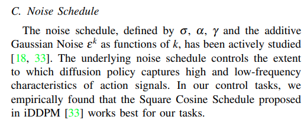

# Diffusion Policy

## Data

:arrow_forward: **observation**

Here observation includes an agent view image, a robot image from its hand, end effector's positions and quaternion, and robot gripper positions. 

```tex
agentview_image:
  shape: [3, 84, 84]
  type: rgb
robot0_eye_in_hand_image:
  shape: [3, 84, 84]
  type: rgb
robot0_eef_pos:
  shape: [3]
  # type default: low_dim
robot0_eef_quat:
  shape: [4]
robot0_gripper_qpos:
  shape: [2]
```

:arrow_forward: **action**

The first three dimension of action is to describe end effector's position change, and the subsequent three dimension is to illustrate rotation change, and the last dimension is to record gripper's status.

```
desired translation of EEF(3), desired delta rotation from current EEF(3), and opening and closing of the gripper fingers:
	shape: [7]
```

## HyperParameters

DDMP algorithm hyperparameters of policy, it can affect the denoising performance.

| name          | definition                                                   | value             |
| ------------- | ------------------------------------------------------------ | ----------------- |
| beta_start    | the starting beta value of inference                         | 0.0001            |
| beta_end      | the final beta value                                         | 0.02              |
| beta_schedule | the beta schedule, a mapping from a beta range to a sequence of betas for stepping the model | squaredcos_cap_v2 |

Task configuration of policy.

| name           | definition                                               | value |
| -------------- | -------------------------------------------------------- | ----- |
| horizon        | the step number of predicted action                      | 10    |
| n_action_steps | the step number of executing action                      | 8     |
| n_obs_steps    | the step number of obs that the model prediction depends | 2     |

Image processing of policy

| name       | definition                                | value |
| ---------- | ----------------------------------------- | ----- |
| crop_shape | the target image dimension after cropping | 10    |

Hyperparameters of model(transformer) that the policy uses.

| name        | definition                                     | value |
| ----------- | ---------------------------------------------- | ----- |
| n_layer     | the layer of decoder/encoder                   | 8     |
| n_head      | head number of multi-head attention            | 4     |
| n_emb       | embedding dimension                            | 256   |
| p_drop_emb  | drop prob of nn.Dropout before encoder/decoder | 0.0   |
| p_drop_attn | drop prob of nn.Dropout in transformer layer   | 0.3   |

EMA parameters.

| name      | definition                                  | value  |
| --------- | ------------------------------------------- | ------ |
| inv_gamma | inverse multiplicative factor of EMA warmup | 1.0    |
| power     | exponential factor of EMA warup             | 0.75   |
| min_value | the minimum EMA decay rate                  | 0.0    |
| max_value | the maximum EMA decay rate                  | 0.9999 |

dataloader：

| name        | definition                            | value |
| ----------- | ------------------------------------- | ----- |
| batch_size  | batch size                            | 64    |
| num_workers | number of processes when loading data | 8     |

optimizer:

| name                     | definition                                               | value       |
| ------------------------ | -------------------------------------------------------- | ----------- |
| transformer_weight_decay | transformer weight decay                                 | 1.0e-3      |
| obs_encoder_weight_decay | obs encoder weight decay                                 | 1.0e-6      |
| learning_rate            | learning rate                                            | 1.0e-4      |
| betas                    | decay rate of first-order moment and second-order moment | [0.9, 0.95] |

```yaml
policy: # policy configuration
	_target_: DiffusionTransformerHybridImagePolicy # policy type
	
	shape_meta: # observations and actions specification
        obs:
            agentview_image:
                shape: [3, 84, 84]
                type: rgb
            robot0_eye_in_hand_image:
                shape: [3, 84, 84]
                type: rgb
            robot0_eef_pos:
                shape: [3]
                # type default: low_dim
            robot0_eef_quat:
                shape: [4]
            robot0_gripper_qpos:
                shape: [2]
        action: 
			shape: [7]
    
    noise_scheduler: # DDPM algorithm's hyperparameters
    	_target: DDPMScheduler	# algorithm type
    	num_train_timesteps: 100
    	beta_start: 0.0001
    	beta_end: 0.02
    	beta_schedule: squaredcos_cap_v2
        variance_type: fixed_small # Yilun's paper uses fixed_small_log instead, but easy to cause Nan
        clip_sample: True # required when predict_epsilon=False
        prediction_type: epsilon # or sample
    # task cfg
    horizon: 10 # dataset sequence length
    n_action_steps: 8	# number of steps of action will be executed
    n_obs_steps: 2 # the latest steps of observations data as input
    num_inference_steps: 100
    # image cfg
    crop_shape: [76, 76]	# images will be cropped into [76, 76]
    obs_encoder_group_norm: False,
    # arch
    n_layer: 8	# transformer decoder/encoder layer number
    n_cond_layers: 0  # >0: use transformer encoder for cond, otherwise use MLP
    n_head: 4	# head number
    n_emb: 256	# embedding dim (input dim --(emb)--> n_emb)
    p_drop_emb: 0.0	# dropout prob (before encoder&decoder)
    p_drop_attn: 0.3	# encoder_layer dropout prob
    causal_attn: True	# mask or not
    time_as_cond: True # if false, use BERT like encoder only arch, time as input
    obs_as_cond: True

# if ema is true
ema:
    _target_: diffusion_policy.model.diffusion.ema_model.EMAModel
    update_after_step: 0
    inv_gamma: 1.0
    power: 0.75
    min_value: 0.0
    max_value: 0.9999
dataloader:
    batch_size: 64
    num_workers: 8
    shuffle: True
    pin_memory: True
    persistent_workers: False

val_dataloader:
    batch_size: 64
    num_workers: 8
    shuffle: False
    pin_memory: True
    persistent_workers: False

optimizer:
    transformer_weight_decay: 1.0e-3
    obs_encoder_weight_decay: 1.0e-6
    learning_rate: 1.0e-4
    betas: [0.9, 0.95]

training:
    device: "cuda:0"
    seed: 42
    debug: False
    resume: True
    # optimization
    lr_scheduler: cosine
    # Transformer needs LR warmup
    lr_warmup_steps: 10
    num_epochs: 100
    gradient_accumulate_every: 1
    # EMA destroys performance when used with BatchNorm
    # replace BatchNorm with GroupNorm.
    use_ema: True
    # training loop control
    # in epochs
    rollout_every: 10
    checkpoint_every: 10
    val_every: 1
    sample_every: 5
    # steps per epoch
    max_train_steps: null
    max_val_steps: null
    # misc
    tqdm_interval_sec: 1.0
```


## Training

### Transformer Network Structure


Transformer based on diffusion policy is actually one noise predictor. Take in noised data with some conditions, it can predict the noise in the data, and then restore its original data. 

> The training process starts by randomly drawing unmodified examples, $x^0$, from the dataset. For each sample, we randomly select a denoising iteration k and them sample a random noise with appropriate variance for iteration k. The model is asked to predict the noise from the data sample with noise added.

In order to get `cond`, here has a <span id="obs_encoder">obs_encoder</span> to get features from observations, including images and states staff.

```python
from robomimic.algo import algo_factory
from robomimic.algo.algo import PolicyAlgo
policy: PolicyAlgo = algo_factory(
        algo_name=config.algo_name,
        config=config,
        obs_key_shapes=obs_key_shapes,
        ac_dim=action_dim,
        device='cpu',
    )
obs_encoder = policy.nets['policy'].nets['encoder'].nets['obs']
print(policy)
'''
============= Initialized Observation Utils with Obs Spec =============

using obs modality: low_dim with keys: ['robot0_gripper_qpos', 'robot0_eef_pos', 'robot0_eef_quat']
using obs modality: rgb with keys: ['robot0_eye_in_hand_image', 'agentview_image']
using obs modality: depth with keys: []
using obs modality: scan with keys: []
ObservationKeyToModalityDict: mean not found, adding mean to mapping with assumed low_dim modality!
ObservationKeyToModalityDict: scale not found, adding scale to mapping with assumed low_dim modality!
ObservationKeyToModalityDict: logits not found, adding logits to mapping with assumed low_dim modality!
BC_RNN_GMM (
  ModuleDict(
    (policy): RNNGMMActorNetwork(
        action_dim=2, std_activation=softplus, low_noise_eval=True, num_nodes=5, min_std=0.0001
  
        encoder=ObservationGroupEncoder(
            group=obs
            ObservationEncoder(
                output_shape=[0]
            )
        )
  
        rnn=RNN_Base(
          (per_step_net): ObservationDecoder(
              Key(
                  name=mean
                  shape=(5, 2)
                  modality=low_dim
                  net=(Linear(in_features=1000, out_features=10, bias=True))
              )
              Key(
                  name=scale
                  shape=(5, 2)
                  modality=low_dim
                  net=(Linear(in_features=1000, out_features=10, bias=True))
              )
              Key(
                  name=logits
                  shape=(5,)
                  modality=low_dim
                  net=(Linear(in_features=1000, out_features=5, bias=True))
              )
          )
          (nets): LSTM(0, 1000, num_layers=2, batch_first=True)
        )
    )
  )
)

'''
```

`Encoder` is designed to encode conditions, like `cond` and `timesteps`. `n_cond_layers` can be set in configuration files, and if it’s > 0, transformer encoder will replace MLP encoder. 

`Decoder` takes in noised actions and encoded information, then predicts a noise with the same shape of X/sample.

Both transformer encoder and decoder are using torch.nn module, their module structure is shown below.

```python
self.cond_pos_emb = nn.Parameter(torch.zeros(1, T_cond, n_emb))
if n_cond_layers > 0:
    encoder_layer = nn.TransformerEncoderLayer(
        d_model=n_emb,
        nhead=n_head,
        dim_feedforward=4*n_emb,
        dropout=p_drop_attn,
        activation='gelu',
        batch_first=True,
        norm_first=True
    )
    self.encoder = nn.TransformerEncoder(
        encoder_layer=encoder_layer,
        num_layers=n_cond_layers
    )
else:
    self.encoder = nn.Sequential(
        nn.Linear(n_emb, 4 * n_emb),
        nn.Mish(),
        nn.Linear(4 * n_emb, n_emb)
    )
# decoder
decoder_layer = nn.TransformerDecoderLayer(
    d_model=n_emb,
    nhead=n_head,
    dim_feedforward=4*n_emb,
    dropout=p_drop_attn,
    activation='gelu',
    batch_first=True,
    norm_first=True # important for stability
)
self.decoder = nn.TransformerDecoder(
    decoder_layer=decoder_layer,
    num_layers=n_layer
)
```

<span id="Forward Details">Forward Details</span>

Its structure is based on minGPT, which is decoder-only. Here it means that the input `X/sample` (noised actions) will only being processed by the transformer decoder, which means that it does not need to learning information from `X/sample` by encoder, conversely it just needs to do the noise prediction task by decoder. Details are below, encoder is to process `cond` and `timestep` only, and decoder is to process `X/sample` only.

```python
timesteps = timesteps.expand(sample.shape[0])
time_emb = self.time_emb(timesteps).unsqueeze(1)
# (B,1,n_emb)

# process input
input_emb = self.input_emb(sample)

# encoder
cond_embeddings = time_emb
if self.obs_as_cond:
    cond_obs_emb = self.cond_obs_emb(cond)
    # (B,To,n_emb)
    cond_embeddings = torch.cat([cond_embeddings, cond_obs_emb], dim=1)
tc = cond_embeddings.shape[1]
position_embeddings = self.cond_pos_emb[
    :, :tc, :
]  # each position maps to a (learnable) vector
x = self.drop(cond_embeddings + position_embeddings)
x = self.encoder(x)
memory = x
# (B,T_cond,n_emb)

# decoder
token_embeddings = input_emb
t = token_embeddings.shape[1]
position_embeddings = self.pos_emb[
    :, :t, :
]  # each position maps to a (learnable) vector
x = self.drop(token_embeddings + position_embeddings)
# (B,T,n_emb)
x = self.decoder(
    tgt=x,
    memory=memory,
    tgt_mask=self.mask,
    memory_mask=self.memory_mask
)
```

### Inputs

`X/sample` is a sequence of noised action (its dimension can be [bs, horizon, action_dim], [B, n_action_step, action_dim] or [bs, horizon, action_dim + obs_feature_dim]). 

`timesteps` is the number of diffusion steps, for instance, if `timesteps=10` then it has 10 steps from the original sample. The greater the timesteps is, the more serious noise the data has.

> Except for transformer network, it also has a obs_encoder, which is designed to extract features from observations. And the extracted features is defined as `cond` below.

`cond` denotes observations' features. The default value of `cond` is `None`, but when `obs_as_cond` is set `True`, which means the model would take observation as a condition, and the detailed procedures are below. 

**TRAINING: **Because we are using `To` steps of observations to do prediction, so first it obtain `this_nobs` from the first `To` of `nobs`. Then, `this_nobs` will be passed through `obs_encoder` to get its features, named `cond`. Conversely, if `obs_as_cond` is `False`, it will do condition through impainting. 

```python
""" TRAINING: How to generate `cond` """
if self.obs_as_cond:
    # reshape B, T, ... to B*T
    this_nobs = dict_apply(nobs, lambda x: x[:,:To,...].reshape(-1,*x.shape[2:]))
    nobs_features = self.obs_encoder(this_nobs)
    # reshape back to B, T, Do
    cond = nobs_features.reshape(batch_size, To, -1)
    if self.pred_action_steps_only:
        start = To - 1
        end = start + self.n_action_steps
        trajectory = nactions[:,start:end]
else:
    # reshape B, T, ... to B*T
    this_nobs = dict_apply(nobs, lambda x: x.reshape(-1, *x.shape[2:]))
    nobs_features = self.obs_encoder(this_nobs)
    # reshape back to B, T, Do
    nobs_features = nobs_features.reshape(batch_size, horizon, -1)
    trajectory = torch.cat([nactions, nobs_features], dim=-1).detach()

# generate impainting mask
if self.pred_action_steps_only:
    condition_mask = torch.zeros_like(trajectory, dtype=torch.bool)
else:
    condition_mask = self.mask_generator(trajectory.shape)
```


### Loss Function

It uses a DDPM to approximate the conditional distribution $p(A_t|O_t)$ for planning. This formulation allows the model to predict actions conditioned on observations without the cost of inferring future states, speeding up the diffusion process and improving the accuracy of generated actions. To capture the conditional distribution,it has:

$A_t^{k-1}=\alpha(A_t^k-\gamma \epsilon_{\theta}(O_t, A_t^k), k) + N(0, \sigma^2I)$

Starting from $A^K$ sampled from Gaussian noise, the DDPM performs $K$ iterations of denoising to produce a series of intermediate actions with hdecreseing levels of noise $A^K, A^{K-1}... A^0$ until a desired noise-free output $A^0$ is formed. Where $\epsilon_{\theta}$ is the noise prediction network with parameter $\theta$ that will be optimized through learning and $N(0, \sigma^2I)$ is Gaussian noise added at each iteration.

The training loss is below:

$Loss = MSE(\epsilon^k, \epsilon_{\theta}(O_t, A_t^0+\epsilon^k,k))$

where $\epsilon^k$ is a random noise with appropriate variance for iteration k. $O_t$ is the observation features.

> `compute_loss` is a method of policy, it is only used in training. However, when testing or doing rollout, it uses `predict_action`, another method of policy. With respect to compute_loss, now we have a original trajectory, first, we produce noise by torch.randn, whose shape is the same as the original trajectory. As talked in transformer model above, except for X/sample (here is trajectory) and `cond`, we also need `timesteps`, here it uses torch.randint. 
>
> When we have noise, and all the required data, then it uses `noise_scheduler` (DDPM algorithm) to add noise in the original trajectory. And this process can be regarded as the forward, therefore, next step is the backward to predict noise with Diffusion Model (DM is actually a noise predictor.). Finally, we use MSE to calculate the loss. 

```python
# this is how the model to calculate loss, and the loss function it uses is MSE_LOSS.
def compute_loss(self, batch):
    # normalize input
    assert 'valid_mask' not in batch
    nobs = self.normalizer.normalize(batch['obs'])
    nactions = self.normalizer['action'].normalize(batch['action'])
    batch_size = nactions.shape[0]
    horizon = nactions.shape[1]
    To = self.n_obs_steps

    # handle different ways of passing observation
    cond = None
    trajectory = nactions
    if self.obs_as_cond:
        # reshape B, T, ... to B*T
        this_nobs = dict_apply(nobs, 
            lambda x: x[:,:To,...].reshape(-1,*x.shape[2:]))
        nobs_features = self.obs_encoder(this_nobs)
        # reshape back to B, T, Do
        cond = nobs_features.reshape(batch_size, To, -1)
        if self.pred_action_steps_only:
            start = To - 1
            end = start + self.n_action_steps
            trajectory = nactions[:,start:end]
    else:
        # reshape B, T, ... to B*T
        this_nobs = dict_apply(nobs, lambda x: x.reshape(-1, *x.shape[2:]))
        nobs_features = self.obs_encoder(this_nobs)
        # reshape back to B, T, Do
        nobs_features = nobs_features.reshape(batch_size, horizon, -1)
        trajectory = torch.cat([nactions, nobs_features], dim=-1).detach()

    # generate impainting mask
    if self.pred_action_steps_only:
        condition_mask = torch.zeros_like(trajectory, dtype=torch.bool)
    else:
        condition_mask = self.mask_generator(trajectory.shape)
""" NOTE: the codes above has been introduced """
    # Sample noise that we'll add to the images
    noise = torch.randn(trajectory.shape, device=trajectory.device)
    bsz = trajectory.shape[0]
    # Sample a random timestep for each image
    timesteps = torch.randint(
        0, self.noise_scheduler.config.num_train_timesteps, 
        (bsz,), device=trajectory.device
    ).long()
    # Add noise to the clean images according to the noise magnitude at each timestep
    # (this is the forward diffusion process)
    noisy_trajectory = self.noise_scheduler.add_noise(
        trajectory, noise, timesteps)

    # compute loss mask
    loss_mask = ~condition_mask

    # apply conditioning
    noisy_trajectory[condition_mask] = trajectory[condition_mask]

    # Predict the noise residual
    pred = self.model(noisy_trajectory, timesteps, cond)

    pred_type = self.noise_scheduler.config.prediction_type 
    if pred_type == 'epsilon':
        target = noise
    elif pred_type == 'sample':
        target = trajectory
    else:
        raise ValueError(f"Unsupported prediction type {pred_type}")

    loss = F.mse_loss(pred, target, reduction='none')
    loss = loss * loss_mask.type(loss.dtype)
    loss = reduce(loss, 'b ... -> b (...)', 'mean')
    loss = loss.mean()
    return loss
```

## Inference

Being different from training, in testing or inference process, we do not exactly actions are, which means that the input `X/sample` is unknown argument. However, we can still get observations from the environment. So here, it uses `torch.randn` to generate a noised trajectory instead of adding noise in original actions like training.

When doing inference/testing/rollout, it will use predict_action function of policy in `env_runner`. The difference between inference and training is that, it would not do backward to update parameters, secondly instead of just getting noise to compute loss, it uses `noise_scheduler.step` to acquire the original trajectory.

First, we introduce how `env_runner` works. It uses `predict_action` and `env.step` to update the simulation until the task is done. 

```python
while not done:
    # create obs dict
    np_obs_dict = dict(obs)
    if self.past_action and (past_action is not None):
        # TODO: not tested
        np_obs_dict['past_action'] = past_action[
            :,-(self.n_obs_steps-1):].astype(np.float32)

    # device transfer
    obs_dict = dict_apply(np_obs_dict, 
        lambda x: torch.from_numpy(x).to(
            device=device))

    # run policy
    with torch.no_grad():
        action_dict = policy.predict_action(obs_dict)

    # device_transfer
    np_action_dict = dict_apply(action_dict,
        lambda x: x.detach().to('cpu').numpy())

    action = np_action_dict['action']
    if not np.all(np.isfinite(action)):
        print(action)
        raise RuntimeError("Nan or Inf action")

    # step env
    env_action = action
    if self.abs_action:
        env_action = self.undo_transform_action(action)

    obs, reward, done, info = env.step(env_action)
    done = np.all(done)
    past_action = action
```

Below is the details of how to implement `predict_action`. And the function `conditional_sample` presents the whole procedures. But compared to `compute_loss`, we can know that `condition_data` (all zero) in inference is `trajectory` (original actions) in training and `trajectory` (produced by torch.randn) in inference is `noisy_trajectory` (original actions + noise).

```python
# ========= inference  ============
def conditional_sample(self, 
        condition_data, condition_mask,
        cond=None, generator=None,
        # keyword arguments to scheduler.step
        **kwargs
        ):
    model = self.model
    scheduler = self.noise_scheduler

    trajectory = torch.randn(
        size=condition_data.shape, 
        dtype=condition_data.dtype,
        device=condition_data.device,
        generator=generator)

    # set step values
    scheduler.set_timesteps(self.num_inference_steps)

    for t in scheduler.timesteps:
        # 1. apply conditioning
        trajectory[condition_mask] = condition_data[condition_mask]

        # 2. predict model output
        model_output = model(trajectory, t, cond)

        # 3. compute previous image: x_t -> x_t-1
        trajectory = scheduler.step(
            model_output, t, trajectory, 
            generator=generator,
            **kwargs
            ).prev_sample

    # finally make sure conditioning is enforced
    trajectory[condition_mask] = condition_data[condition_mask]        

    return trajectory

def predict_action(self, obs_dict: Dict[str, torch.Tensor]) -> Dict[str, torch.Tensor]:
    """
    obs_dict: must include "obs" key
    result: must include "action" key
    """
    if self.obs_as_cond:
        this_nobs = dict_apply(nobs, lambda x: x[:,:To,...].reshape(-1,*x.shape[2:]))
        nobs_features = self.obs_encoder(this_nobs)
        # reshape back to B, To, Do
        cond = nobs_features.reshape(B, To, -1)
        shape = (B, T, Da)
        if self.pred_action_steps_only:
            shape = (B, self.n_action_steps, Da)
        cond_data = torch.zeros(size=shape, device=device, dtype=dtype)
        cond_mask = torch.zeros_like(cond_data, dtype=torch.bool)
    else:
        # condition through impainting
        this_nobs = dict_apply(nobs, lambda x: x[:,:To,...].reshape(-1,*x.shape[2:]))
        nobs_features = self.obs_encoder(this_nobs)
        # reshape back to B, T, Do
        nobs_features = nobs_features.reshape(B, T, -1)
        shape = (B, T, Da+Do)
        cond_data = torch.zeros(size=shape, device=device, dtype=dtype)
        cond_mask = torch.zeros_like(cond_data, dtype=torch.bool)
        cond_data[:,:To,Da:] = nobs_features
        cond_mask[:,:To,Da:] = True
    # run sampling
    nsample = self.conditional_sample(
        cond_data, 
        cond_mask,
        cond=cond,
        **self.kwargs)

    # unnormalize prediction
    naction_pred = nsample[...,:Da]
    action_pred = self.normalizer['action'].unnormalize(naction_pred)

    # get action
    if self.pred_action_steps_only:
        action = action_pred
    else:
        start = To - 1
        end = start + self.n_action_steps
        action = action_pred[:,start:end]

    result = {
        'action': action,
        'action_pred': action_pred
    }
    return result
```

Here is the algorithm of `noise_scheduler.step`. (x_t -> x_t-1)

```python
# 1. compute alphas, betas
# 2. compute predicted original sample from predicted noise also called
# 3. Clip "predicted x_0"
# 4. Compute coefficients for pred_original_sample x_0 and current sample x_t
# 5. Compute predicted previous sample µ_t
pred_prev_sample = pred_original_sample_coeff * pred_original_sample + current_sample_coeff * sample
# 6. Add noise
pred_prev_sample = pred_prev_sample + variance
```

## Comments

1. What are the values of alpha, gamma in the denoising process?



> gamma is the learning rate. alpha is a weight to denote the importance of noise.

2. What is the value of the variance for iteration k? 

```python
# first sample a variance noise
variance_noise = torch.randn(model_output.shape, dtype=model_output.dtype, generator=generator)
# use _get_variance to get variance of timestep k
variance = (1 - alpha_prod_t_prev) / (1 - alpha_prod_t) * self.betas[t]
variance = torch.clamp(variance, min=1e-20)
# finally do 
variance = (self._get_variance(t, predicted_variance=predicted_variance) ** 0.5) * variance_noise
```


3. The Visual Encoder is missing. Add it before the diffusion transformer.

> done, see <a href="#obs_encoder">obs_encoder</a>

4. The diffusion transformer adopts the architecture from the minGPT (check it out), which is a decoder-only variant of the Transformer. Modify the content accordingly.

> See <a href="#Forward Details">Forward Details</a>

