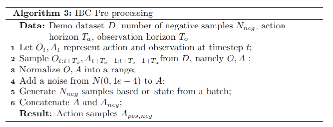
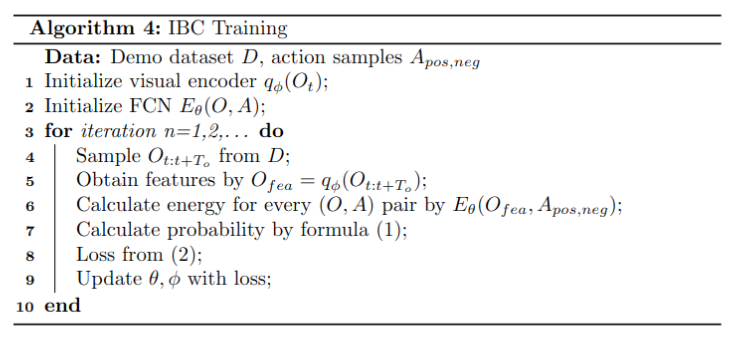
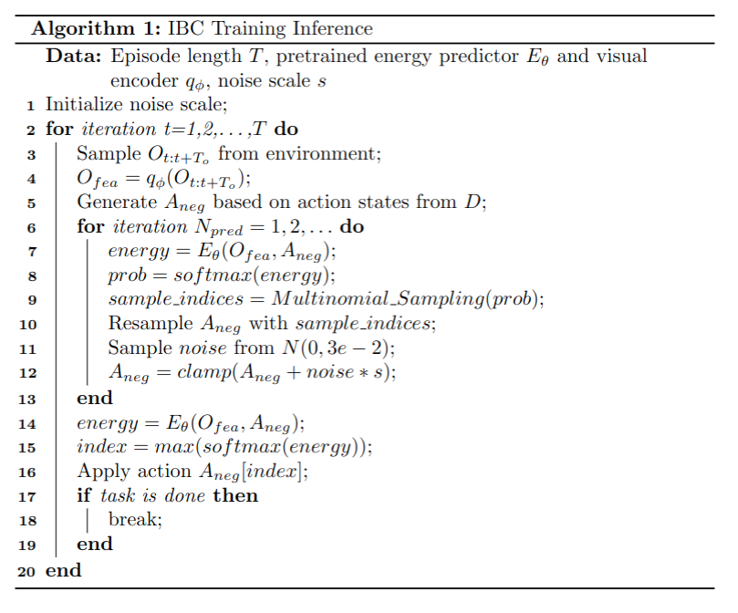

# Implicit Behavioral Cloning

## Data

### Dataset

This section shows the whole dataset structure of every demonstration. It saves action the robot did, rewards the robot got, states of the whole settings, whether the task was done, and observations at every timestep. The observations contains images from two cameras, end-effector states, joint states and gripper states.

```
.demo
├── actions	shape: (episode length, 7)
├── dones	shape: (episode length,)
├── rewards	shape: (episode length,)
├── states	shape: (episode length, 45)
├── obs
	├── agentview_image			shape: (episode length, 84, 84, 3)
	├── robot0_eye_in_hand_image		shape: (episode length, 84, 84, 3)
	├── robot0_eef_pos			shape: (episode length, 3)
	├── robot0_eef_quat 			shape: (episode length, 4)
	├── robot0_eef_vel_ang			shape: (episode length, 3)
	├── robot0_eef_vel_lin			shape: (episode length, 3)
	├── robot0_gripper_qpos			shape: (episode length, 2)
	├── robot0_gripper_qvel			shape: (episode length, 2)
	├── robot0_joint_pos    		shape: (episode length, 7)
	├── robot0_joint_pos_cos    		shape: (episode length, 7)
	├── robot0_joint_pos_sin    		shape: (episode length, 7)
	├── robot0_joint_vel    		shape: (episode length, 7)
	└── object    				shape: (episode length, 14)
├── next_obs
	├── agentview_image			shape: (episode length, 84, 84, 3)
	├── robot0_eye_in_hand_image		shape: (episode length, 84, 84, 3)
	├── robot0_eef_pos			shape: (episode length, 3)
	├── robot0_eef_quat 			shape: (episode length, 4)
	├── robot0_eef_vel_ang			shape: (episode length, 3)
	├── robot0_eef_vel_lin			shape: (episode length, 3)
	├── robot0_gripper_qpos			shape: (episode length, 2)
	├── robot0_gripper_qvel			shape: (episode length, 2)
	├── robot0_joint_pos    		shape: (episode length, 7)
	├── robot0_joint_pos_cos    		shape: (episode length, 7)
	├── robot0_joint_pos_sin    		shape: (episode length, 7)
	├── robot0_joint_vel    		shape: (episode length, 7)
	└── object    				shape: (episode length, 14)
```

### <span id="obs shape">Observation</span>

- Image of the top-down camera (84, 84, 3), rgb
- Image of the wrist camera (84, 84, 3), rgb
- End effector's position and orientation (3, 4), low_dim
- Gripper's position (2), low_dim

The default type of observations is low dimension. The type of data would affect its network structure which will process the data itself later.

### Action

- Desired translation of EEF (3)
- Desired rotation change from current EEF (3)
- Opening or closing of the gripper fingers (1)

## HyperParameters

Task configuration of policy.

| name           | definition                                                   | value |
| -------------- | ------------------------------------------------------------ | ----- |
| horizon        | the step number of predicted action                          | 10    |
| n_action_steps | the step number of executing action                          | 8     |
| n_obs_steps    | the step number of obs that the model prediction depends     | 2     |
| dropout        | dropout probability                                          | 0.1   |
| train_n_neg    | the number of negative samples it produces in training process | 100   |
| pred_n_iter    | the number of iteration while doing prediction               | 5     |
| pred_n_samples | the number of samples it generates in inference process      | 100   |
| crop_shape     | the target image dimension after cropping                    | 10    |

```yaml
horizon: 10
n_obs_steps: 2
n_action_steps: 8
n_latency_steps: 0
dataset_obs_steps: ${n_obs_steps}
past_action_visible: False
keypoint_visible_rate: 1.0

policy:
  _target_: diffusion_policy.policy.ibc_dfo_hybrid_image_policy.IbcDfoHybridImagePolicy

  shape_meta: ${shape_meta}

  horizon: ${horizon}
  n_action_steps: ${eval:'${n_action_steps}+${n_latency_steps}'}
  n_obs_steps: ${n_obs_steps}
  dropout: 0.1
  train_n_neg: 100
  pred_n_iter: 5
  pred_n_samples: 100
  kevin_inference: False
  andy_train: True
  obs_encoder_group_norm: True
  eval_fixed_crop: True
  crop_shape: [76, 76]

dataloader:
  batch_size: 64
  num_workers: 8
  shuffle: True
  pin_memory: True
  persistent_workers: False

val_dataloader:
  batch_size: 64
  num_workers: 8
  shuffle: False
  pin_memory: True
  persistent_workers: False

optimizer:
  _target_: torch.optim.AdamW
  lr: 1.0e-4
  betas: [0.95, 0.999]
  eps: 1.0e-8
  weight_decay: 1.0e-6

training:
  device: "cuda:0"
  seed: 42
  debug: False
  resume: True
  # optimization
  lr_scheduler: cosine
  lr_warmup_steps: 10
  num_epochs: 100
  gradient_accumulate_every: 1
  # training loop control
  # in epochs
  rollout_every: 10
  checkpoint_every: 10
  val_every: 1
  sample_every: 5
  sample_max_batch: 128
  # steps per epoch
  max_train_steps: null
  max_val_steps: null
  # misc
  tqdm_interval_sec: 1.0

logging:
  project: implicit_BC_debug
  resume: True
  mode: online
  name: ${now:%Y.%m.%d-%H.%M.%S}_${name}_${task_name}
  tags: ["${name}", "${task_name}", "${exp_name}"]
  id: null
  group: null

checkpoint:
  topk:
    monitor_key: test_mean_score
    mode: max
    k: 5
    format_str: 'epoch={epoch:04d}-test_mean_score={test_mean_score:.3f}.ckpt'
  save_last_ckpt: True
  save_last_snapshot: False
```


## Network

<div align="center">
    
</div>
|        |               name & shape               |                   definition                   |
| :----: | :--------------------------------------: | :--------------------------------------------: |
| Input  |   actions \| [batch_size, horizon, 7]    |          sequence of original actions          |
|        |             obs \| see above             |       sequence of original observations        |
| Output | energy value \| [batch_size, horizon, 7] | the association of a pair (e.g. [obs, action]) |

The whole model is actually doing two things.

1. Construct observations and actions pairs, including positive pairs (true action sequence under current observations) and negative pairs (current observations and generated action sequence based on true actions distribution).
2. Predict the energy value for every single pair.

### Action Pre-processing

|        |                       name \| shape                       |                     definition                      |
| :----: | :-------------------------------------------------------: | :-------------------------------------------------: |
| Input  |            actions \| [batch_size, horizon, 7]            |            sequence of original actions             |
| Output | action_samples \| [batch_size, train_n_neg+1, horizon, 7] | samples combined with positive and negative samples |

<div align="center">
    
</div>

```python
# Small additive noise to true positives.
this_action += torch.normal(mean=0, std=1e-4,
    size=this_action.shape,
    dtype=this_action.dtype,
    device=this_action.device)

# Sample negatives: (B, train_n_neg, Ta, Da)
naction_stats = self.get_naction_stats()
action_dist = torch.distributions.Uniform(
    low=naction_stats['min'],
    high=naction_stats['max']
)
samples = action_dist.sample((B, self.train_n_neg, Ta)).to(
    dtype=this_action.dtype)
action_samples = torch.cat([
    this_action.unsqueeze(1), samples], dim=1)
# (B, train_n_neg+1, Ta, Da)
```

### Visual Encoder

the same as described in DP.md.

### Fully Connected Network

Some stacked linear layers.

```python
self.dense0 = nn.Linear(in_features=in_channels, out_features=mid_channels)
self.drop0 = nn.Dropout(dropout)
self.dense1 = nn.Linear(in_features=mid_channels, out_features=mid_channels)
self.drop1 = nn.Dropout(dropout)
self.dense2 = nn.Linear(in_features=mid_channels, out_features=mid_channels)
self.drop2 = nn.Dropout(dropout)
self.dense3 = nn.Linear(in_features=mid_channels, out_features=mid_channels)
self.drop3 = nn.Dropout(dropout)
self.dense4 = nn.Linear(in_features=mid_channels, out_features=out_channels)
```

Forward Details

```python
def forward(self, obs, action):
    B, N, Ta, Da = action.shape
    B, To, Do = obs.shape
    s = obs.reshape(B,1,-1).expand(-1,N,-1)
    x = torch.cat([s, action.reshape(B,N,-1)], dim=-1).reshape(B*N,-1)
    x = self.drop0(torch.relu(self.dense0(x)))
    x = self.drop1(torch.relu(self.dense1(x)))
    x = self.drop2(torch.relu(self.dense2(x)))
    x = self.drop3(torch.relu(self.dense3(x)))
    x = self.dense4(x)
    x = x.reshape(B,N)
    return x
```


## Training

In this work, it proposes to reformulate BC using implicit models - specifically, the composition of argmin with a continuous energy function $E_{\theta}$ to represent the policy $\pi_{\theta}$.

<div align="center">
    
</div>


The training consists of generating a set of negative counter-examples $[A_i^j]^{N_{neg}}_{j=1}$ for each sample $A_i$ in a batch, and employing an InfoNCE-style loss function.

<div align="center">
    
</div>


The fundamental idea behind this loss function is to maximize the mutual information between positive sample pairs, which are drawn from the same instance but sampled under different transformations or perspectives. The objective of the loss is to guide the network in distinguishing between positive pairs and negative pairs sampled from other instances. Here, pairs refer to Observations and Actions and the energy here can be simply defined the correlation between current observation and current action.

$E_{\theta}(O_t, A_t)$ denotes energy predictor; $N$ is the number of the overall samples. $B$ is batch size. So the training process is make the model to remember the best action given current observations. Therefore, when inferencing, we can select the best action from generated samples which are produced with the original action distribution.

<div align="center">
    
</div>

```python
def compute_loss(self, batch):
    # normalize input
    assert 'valid_mask' not in batch
    nobs = self.normalizer.normalize(batch['obs'])
    naction = self.normalizer['action'].normalize(batch['action'])

    # shapes
    Do = self.obs_feature_dim
    Da = self.action_dim
    To = self.n_obs_steps
    Ta = self.n_action_steps
    T = self.horizon
    B = naction.shape[0]

    # encode obs
    # reshape B, T, ... to B*T
    this_nobs = dict_apply(nobs, 
        lambda x: x[:,:To,...].reshape(-1,*x.shape[2:]))
    nobs_features = self.obs_encoder(this_nobs)
    # reshape back to B, To, Do
    nobs_features = nobs_features.reshape(B,To,-1)

    start = To - 1
    end = start + Ta
    this_action = naction[:,start:end]

    # Small additive noise to true positives.
    this_action += torch.normal(mean=0, std=1e-4,
        size=this_action.shape,
        dtype=this_action.dtype,
        device=this_action.device)

    # Sample negatives: (B, train_n_neg, Ta, Da)
    naction_stats = self.get_naction_stats()
    action_dist = torch.distributions.Uniform(
        low=naction_stats['min'],
        high=naction_stats['max']
    )
    samples = action_dist.sample((B, self.train_n_neg, Ta)).to(
        dtype=this_action.dtype)
    action_samples = torch.cat([
        this_action.unsqueeze(1), samples], dim=1)
    # (B, train_n_neg+1, Ta, Da)

    if self.andy_train:
        # Get onehot labels
        labels = torch.zeros(action_samples.shape[:2], 
            dtype=this_action.dtype, device=this_action.device)
        labels[:,0] = 1
        logits = self.forward(nobs_features, action_samples)
        # (B, N)
        logits = torch.log_softmax(logits, dim=-1)
        loss = -torch.mean(torch.sum(logits * labels, axis=-1))
    else:
        labels = torch.zeros((B,),dtype=torch.int64, device=this_action.device)
        # training (bs, To, obs_features_dim) (B, train_n_neg+1, Ta, Da)
        logits = self.forward(nobs_features, action_samples)
        loss = F.cross_entropy(logits, labels)
    return loss
```

## Inference

We use the states of the action dataset we have, i.e. min and max value to establish one distribution, and then generate samples with shape [batch_size, pred_n_samples, Ta, Da]. Secondly, we use observations and samples to calculate energy of per [Ta, Da]. Finally, we choose the best for every batch and get actions [batch_size, Ta, Da]. 

Andy’s implementation and Kevin’s implementation are a little similar, here I just simply introduce Kevin’s implementation.

<div align="center">
    
</div>

```python
def predict_action(self, obs_dict: Dict[str, torch.Tensor]) -> Dict[str, torch.Tensor]:
    """
    obs_dict: must include "obs" key
    result: must include "action" key
    """
    assert 'past_action' not in obs_dict # not implemented yet
    # normalize input
    nobs = self.normalizer.normalize(obs_dict)
    value = next(iter(nobs.values()))
    B, To = value.shape[:2]
    T = self.horizon
    Ta = self.n_action_steps
    Da = self.action_dim
    Do = self.obs_feature_dim
    To = self.n_obs_steps

    # build input
    device = self.device
    dtype = self.dtype

    # encode obs
    # reshape B, T, ... to B*T
    this_nobs = dict_apply(nobs, 
        lambda x: x[:,:To,...].reshape(-1,*x.shape[2:]))
    nobs_features = self.obs_encoder(this_nobs)
    # reshape back to B, To, Do
    nobs_features = nobs_features.reshape(B,To,-1)

    # only take necessary obs
    naction_stats = self.get_naction_stats()

    # first sample
    action_dist = torch.distributions.Uniform(
        low=naction_stats['min'],
        high=naction_stats['max']
    )
    samples = action_dist.sample((B, self.pred_n_samples, Ta)).to(
        dtype=dtype)
    # (B, N, Ta, Da)

    if self.kevin_inference:
        # kevin's implementation
        noise_scale = 3e-2
        for i in range(self.pred_n_iter):
            # Compute energies.
            logits = self.forward(nobs_features, samples)
            probs = F.softmax(logits, dim=-1)

            # Resample with replacement.
            idxs = torch.multinomial(probs, self.pred_n_samples, replacement=True)
            samples = samples[torch.arange(samples.size(0)).unsqueeze(-1), idxs]

            # Add noise and clip to target bounds.
            samples = samples + torch.randn_like(samples) * noise_scale
            samples = samples.clamp(min=naction_stats['min'], max=naction_stats['max'])

        # Return target with highest probability.
        logits = self.forward(nobs_features, samples)
        probs = F.softmax(logits, dim=-1)
        best_idxs = probs.argmax(dim=-1)
        acts_n = samples[torch.arange(samples.size(0)), best_idxs, :]
    else:
        # andy's implementation
        zero = torch.tensor(0, device=self.device)
        resample_std = torch.tensor(3e-2, device=self.device)
        for i in range(self.pred_n_iter):
            # Forward pass.
            logits = self.forward(nobs_features, samples) # (B, N)
            prob = torch.softmax(logits, dim=-1)

            if i < (self.pred_n_iter - 1):
                idxs = torch.multinomial(prob, self.pred_n_samples, replacement=True)
                samples = samples[torch.arange(samples.size(0)).unsqueeze(-1), idxs]
                samples += torch.normal(zero, resample_std, size=samples.shape, device=self.device)

        # Return one sample per x in batch.
        idxs = torch.multinomial(prob, num_samples=1, replacement=True)
        acts_n = samples[torch.arange(samples.size(0)).unsqueeze(-1), idxs].squeeze(1)

    action = self.normalizer['action'].unnormalize(acts_n)
    result = {
        'action': action
    }
    return result
```

