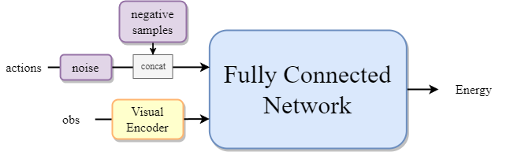
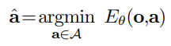

# Implicit Behavioral Cloning

## Data

### Original Data in HDF5 File

The official provides dataset in `hdf5` format. The `hdf5` file saves many stuffs of demonstrations, such as actions, dones(whether the episode is done), rewards, states(vectors describing the robot states), and obs. However, for training the policy, here just uses a part of this dataset.

```yaml
Group: /data/demo_0
  Dataset: /data/demo_0/actions    shape: (127, 7)
  Dataset: /data/demo_0/dones    shape: (127,)
  Dataset: /data/demo_0/rewards    shape: (127,)
  Dataset: /data/demo_0/states    shape: (127, 45)
  Group: /data/demo_0/next_obs
    Dataset: /data/demo_0/next_obs/agentview_image    shape: (127, 84, 84, 3)
    Dataset: /data/demo_0/next_obs/object    shape: (127, 14)
    Dataset: /data/demo_0/next_obs/robot0_eef_pos    shape: (127, 3)
    Dataset: /data/demo_0/next_obs/robot0_eef_quat    shape: (127, 4)
    Dataset: /data/demo_0/next_obs/robot0_eef_vel_ang    shape: (127, 3)
    Dataset: /data/demo_0/next_obs/robot0_eef_vel_lin    shape: (127, 3)
    Dataset: /data/demo_0/next_obs/robot0_eye_in_hand_image    shape: (127, 84, 84, 3)
    Dataset: /data/demo_0/next_obs/robot0_gripper_qpos    shape: (127, 2)
    Dataset: /data/demo_0/next_obs/robot0_gripper_qvel    shape: (127, 2)
    Dataset: /data/demo_0/next_obs/robot0_joint_pos    shape: (127, 7)
    Dataset: /data/demo_0/next_obs/robot0_joint_pos_cos    shape: (127, 7)
    Dataset: /data/demo_0/next_obs/robot0_joint_pos_sin    shape: (127, 7)
    Dataset: /data/demo_0/next_obs/robot0_joint_vel    shape: (127, 7)
  Group: /data/demo_0/obs
    Dataset: /data/demo_0/obs/agentview_image    shape: (127, 84, 84, 3)
    Dataset: /data/demo_0/obs/object    shape: (127, 14)
    Dataset: /data/demo_0/obs/robot0_eef_pos    shape: (127, 3)
    Dataset: /data/demo_0/obs/robot0_eef_quat    shape: (127, 4)
    Dataset: /data/demo_0/obs/robot0_eef_vel_ang    shape: (127, 3)
    Dataset: /data/demo_0/obs/robot0_eef_vel_lin    shape: (127, 3)
    Dataset: /data/demo_0/obs/robot0_eye_in_hand_image    shape: (127, 84, 84, 3)
    Dataset: /data/demo_0/obs/robot0_gripper_qpos    shape: (127, 2)
    Dataset: /data/demo_0/obs/robot0_gripper_qvel    shape: (127, 2)
    Dataset: /data/demo_0/obs/robot0_joint_pos    shape: (127, 7)
    Dataset: /data/demo_0/obs/robot0_joint_pos_cos    shape: (127, 7)
    Dataset: /data/demo_0/obs/robot0_joint_pos_sin    shape: (127, 7)
    Dataset: /data/demo_0/obs/robot0_joint_vel    shape: (127, 7)
```

### observations

Here observation includes an agent view image, a robot image from its hand, end effector's positions and quaternion, and robot gripper positions. 

```yaml
agentview_image:
  shape: [3, 84, 84]
  type: rgb
robot0_eye_in_hand_image:
  shape: [3, 84, 84]
  type: rgb
robot0_eef_pos:
  shape: [3]
  # type default: low_dim
robot0_eef_quat:
  shape: [4]
robot0_gripper_qpos:
  shape: [2]
```

### action

The first three dimension of action is to describe end effector's position change, and the subsequent three dimension is to illustrate rotation change, and the last dimension is to record gripper's status.

```yaml
action:
	shape: [7]
```

## HyperParameters

Task configuration of policy.

| name           | definition                                                   | value |
| -------------- | ------------------------------------------------------------ | ----- |
| horizon        | the step number of predicted action                          | 10    |
| n_action_steps | the step number of executing action                          | 8     |
| n_obs_steps    | the step number of obs that the model prediction depends     | 2     |
| dropout        | dropout probability                                          | 0.1   |
| train_n_neg    | the number of negative samples it produces in training process | 100   |
| pred_n_iter    | the number of iteration while doing prediction               | 5     |
| pred_n_samples | the number of samples it generates in inference process      | 100   |
| crop_shape     | the target image dimension after cropping                    | 10    |

```yaml
horizon: 10
n_obs_steps: 2
n_action_steps: 8
n_latency_steps: 0
dataset_obs_steps: ${n_obs_steps}
past_action_visible: False
keypoint_visible_rate: 1.0

policy:
  _target_: diffusion_policy.policy.ibc_dfo_hybrid_image_policy.IbcDfoHybridImagePolicy

  shape_meta: ${shape_meta}

  horizon: ${horizon}
  n_action_steps: ${eval:'${n_action_steps}+${n_latency_steps}'}
  n_obs_steps: ${n_obs_steps}
  dropout: 0.1
  train_n_neg: 100
  pred_n_iter: 5
  pred_n_samples: 100
  kevin_inference: False
  andy_train: True
  obs_encoder_group_norm: True
  eval_fixed_crop: True
  crop_shape: [76, 76]

dataloader:
  batch_size: 64
  num_workers: 8
  shuffle: True
  pin_memory: True
  persistent_workers: False

val_dataloader:
  batch_size: 64
  num_workers: 8
  shuffle: False
  pin_memory: True
  persistent_workers: False

optimizer:
  _target_: torch.optim.AdamW
  lr: 1.0e-4
  betas: [0.95, 0.999]
  eps: 1.0e-8
  weight_decay: 1.0e-6

training:
  device: "cuda:0"
  seed: 42
  debug: False
  resume: True
  # optimization
  lr_scheduler: cosine
  lr_warmup_steps: 10
  num_epochs: 100
  gradient_accumulate_every: 1
  # training loop control
  # in epochs
  rollout_every: 10
  checkpoint_every: 10
  val_every: 1
  sample_every: 5
  sample_max_batch: 128
  # steps per epoch
  max_train_steps: null
  max_val_steps: null
  # misc
  tqdm_interval_sec: 1.0

logging:
  project: implicit_BC_debug
  resume: True
  mode: online
  name: ${now:%Y.%m.%d-%H.%M.%S}_${name}_${task_name}
  tags: ["${name}", "${task_name}", "${exp_name}"]
  id: null
  group: null

checkpoint:
  topk:
    monitor_key: test_mean_score
    mode: max
    k: 5
    format_str: 'epoch={epoch:04d}-test_mean_score={test_mean_score:.3f}.ckpt'
  save_last_ckpt: True
  save_last_snapshot: False
```


## Network



**INPUTS**

- actions
  - definition: original action sequence
  - shape: [batch_size, horizon, 7]
  - type: tensor
- obs
  - definition: observations
  - shape: see below
  - type: dict

```yaml
obs:
	agentview_image:
		shape: [batch_size, n_obs_steps, 3, 84, 84]
		type: rgb
	robot0_eye_in_hand_image:
		shape: [batch_size, n_obs_steps, 3, 84, 84]
		type: rgb
	robot0_eef_pos:
		shape: [batch_size, n_obs_steps, 3]
	robot0_eef_quat:
		shape: [batch_size, n_obs_steps, 4]
	robot0_gripper_qpos:
		shape: [batch_size, n_obs_steps, 2]
```

**OUTPUT**

- energy value
  - definition: the difference between professional actions and unprofessional actions. The less value it is, the more stable the system is.
  - shape: [batch_size, train_n_neg+1]
  - type: tensor

### Action Pre-processing

**INPUT**

- actions

  - definition: original action sequence

  - shape: [batch_size, horizon, 7]

  - type: tensor

**OUTPUT**

- action_samples
  - definition: actions with averagely generated negative actions
  - shape: [batch_size, train_n_neg+1, horizon, 7]
  - type: tensor

> 1. extract `obs` and `action` from one batch
> 2. normalize `obs` and `action` to obtain `nobs` and `naction`
> 3. get `this_action` (this_action = naction[:, To-1:To-1+horizon])
> 4. add noise to `this_action`
> 5. compute status of naction, includes min, max, mean and std
> 6. establish a distribution with min and max value of naction
> 7. use this distribution to generate samples in (B, train_n_neg, Ta, Da) shape
> 8. concatenate negative samples and this_action in dimension one, so finally we get action in (B, train_n_neg+1, Ta, Da) shape

```python
# Small additive noise to true positives.
this_action += torch.normal(mean=0, std=1e-4,
    size=this_action.shape,
    dtype=this_action.dtype,
    device=this_action.device)

# Sample negatives: (B, train_n_neg, Ta, Da)
naction_stats = self.get_naction_stats()
action_dist = torch.distributions.Uniform(
    low=naction_stats['min'],
    high=naction_stats['max']
)
samples = action_dist.sample((B, self.train_n_neg, Ta)).to(
    dtype=this_action.dtype)
action_samples = torch.cat([
    this_action.unsqueeze(1), samples], dim=1)
# (B, train_n_neg+1, Ta, Da)
```

### Visual Encoder

the same as described in DP.md.

### Fully Connected Network

Some stacked linear layers.

```python
self.dense0 = nn.Linear(in_features=in_channels, out_features=mid_channels)
self.drop0 = nn.Dropout(dropout)
self.dense1 = nn.Linear(in_features=mid_channels, out_features=mid_channels)
self.drop1 = nn.Dropout(dropout)
self.dense2 = nn.Linear(in_features=mid_channels, out_features=mid_channels)
self.drop2 = nn.Dropout(dropout)
self.dense3 = nn.Linear(in_features=mid_channels, out_features=mid_channels)
self.drop3 = nn.Dropout(dropout)
self.dense4 = nn.Linear(in_features=mid_channels, out_features=out_channels)
```

Forward Details

```python
def forward(self, obs, action):
    B, N, Ta, Da = action.shape
    B, To, Do = obs.shape
    s = obs.reshape(B,1,-1).expand(-1,N,-1)
    x = torch.cat([s, action.reshape(B,N,-1)], dim=-1).reshape(B*N,-1)
    x = self.drop0(torch.relu(self.dense0(x)))
    x = self.drop1(torch.relu(self.dense1(x)))
    x = self.drop2(torch.relu(self.dense2(x)))
    x = self.drop3(torch.relu(self.dense3(x)))
    x = self.dense4(x)
    x = x.reshape(B,N)
    return x
```


## Training

In this work, it proposes to reformulate BC using implicit models - specifically, the composition of argmin with a continuous energy function $E_{\theta}$ to represent the policy $\pi_{\theta}$.

<div align="center">
    
</div>


The training consists of generating a set of negative counter-examples $\{\widehat{A}_i^j\}^{N_{neg}}_{j=1}$ for each sample $A_i$ in a batch, and employing an InfoNCE-style loss function.

$Loss=\sum^B_{j=1}\sum^N_{i=1}{-\log(p_{\theta}(A_i|O_i,\{\hat{A}_i^j\}^{N_{neg}}_{j=1}))} -(1)$ 

$p_{\theta}(A_i|O_i,\{\hat{A}_i^j\}^{N_{neg}}_{j=1})=\frac{\exp{-E_{\theta}(O_i,A_i)}}{\exp{-E_{\theta}(O_i,A_i)}+\sum^{N_{neg}}_{j=1}{\exp{-E_{\theta}(O_i,\hat{A}_i^j)}}}-(2)$

The fundamental idea behind this loss function is to maximize the mutual information between positive sample pairs, which are drawn from the same instance but sampled under different transformations or perspectives. The objective of the loss is to guide the network in distinguishing between positive pairs and negative pairs sampled from other instances. Here, pairs refer to Observations and Actions and the energy here can be simply defined the correlation between current observation and current action.

$E_{\theta}(O_t, A_t)$ denotes energy predictor; $N$ is the number of the overall samples. $B$ is batch size. So the training process is make the model to remember the best action given current observations. Therefore, when inferencing, we can select the best action from generated samples which are produced with the original action distribution.

> 1: Given: Demo dataset $D$
>
> 2: Let $O_i$ and $A_i$ represent observation and action at timestep $i$, and $\{\hat{A}_i^j\}^{N_{neg}}_{j=1}$ denotes negative samples.
>
> 3: Initialize visual encoder $q_{\phi}(O_i)$.
>
> 4: Initialize FCN $E_{\theta}(q_{\phi}(O_i),[A_i,\{\hat{A}_i^j\}^{N_{neg}}_{j=1}])$.
>
> 5: for iteration n = 1,2, ..., do
>
> 6: 	sample $O_i$ and $A_i$ from $D$
>
> 7: 	generate $\{\hat{A}_i^j\}^{N_{neg}}_{j=1}$ based on $A_i$ and get $[A_i,\{\hat{A}_i^j\}^{N_{neg}}_{j=1}]$
>
> 8: 	energy = $E_{\theta}(q_{\phi}(O_i),[A_i,\{\hat{A}_i^j\}^{N_{neg}}_{j=1}])$
>
> 9: 	calculate probability (2)
>
> 10:	Loss = (1)
>
> 11:	Update $\theta, \phi$ with loss

```python
def compute_loss(self, batch):
    # normalize input
    assert 'valid_mask' not in batch
    nobs = self.normalizer.normalize(batch['obs'])
    naction = self.normalizer['action'].normalize(batch['action'])

    # shapes
    Do = self.obs_feature_dim
    Da = self.action_dim
    To = self.n_obs_steps
    Ta = self.n_action_steps
    T = self.horizon
    B = naction.shape[0]

    # encode obs
    # reshape B, T, ... to B*T
    this_nobs = dict_apply(nobs, 
        lambda x: x[:,:To,...].reshape(-1,*x.shape[2:]))
    nobs_features = self.obs_encoder(this_nobs)
    # reshape back to B, To, Do
    nobs_features = nobs_features.reshape(B,To,-1)

    start = To - 1
    end = start + Ta
    this_action = naction[:,start:end]

    # Small additive noise to true positives.
    this_action += torch.normal(mean=0, std=1e-4,
        size=this_action.shape,
        dtype=this_action.dtype,
        device=this_action.device)

    # Sample negatives: (B, train_n_neg, Ta, Da)
    naction_stats = self.get_naction_stats()
    action_dist = torch.distributions.Uniform(
        low=naction_stats['min'],
        high=naction_stats['max']
    )
    samples = action_dist.sample((B, self.train_n_neg, Ta)).to(
        dtype=this_action.dtype)
    action_samples = torch.cat([
        this_action.unsqueeze(1), samples], dim=1)
    # (B, train_n_neg+1, Ta, Da)

    if self.andy_train:
        # Get onehot labels
        labels = torch.zeros(action_samples.shape[:2], 
            dtype=this_action.dtype, device=this_action.device)
        labels[:,0] = 1
        logits = self.forward(nobs_features, action_samples)
        # (B, N)
        logits = torch.log_softmax(logits, dim=-1)
        loss = -torch.mean(torch.sum(logits * labels, axis=-1))
    else:
        labels = torch.zeros((B,),dtype=torch.int64, device=this_action.device)
        # training (bs, To, obs_features_dim) (B, train_n_neg+1, Ta, Da)
        logits = self.forward(nobs_features, action_samples)
        loss = F.cross_entropy(logits, labels)
    return loss
```

## Inference

We use the states of the action dataset we have, i.e. min and max value to establish one distribution, and then generate samples with shape [batch_size, pred_n_samples, Ta, Da]. Secondly, we use observations and samples to calculate energy of per [Ta, Da]. Finally, we choose the best for every batch and get actions [batch_size, Ta, Da]. 

Andy’s implementation and Kevin’s implementation are a little similar, here I just simply introduce Kevin’s implementation.

> 1. initialize noise scale
> 2. LOOP
>    - Given observation features and generated samples, we use our model to predict energy for every sample.
>    - Transform the energy values into a probability distribution using softmax function.
>    - Sample new action indices based on the probability distribution using a multinomial distribution.
>    - Resample new action samples from the original action samples set using the new sample indices.
>    - Add noise following a normal distribution and restrict the action samples within a reasonable range.
> 3. Calculate energy values
> 4. Transform into probability.
> 5. select the index with the highest probability.
> 6. Choose the corresponding optimal action from the action samples based on the index with highest probability.

```python
def predict_action(self, obs_dict: Dict[str, torch.Tensor]) -> Dict[str, torch.Tensor]:
    """
    obs_dict: must include "obs" key
    result: must include "action" key
    """
    assert 'past_action' not in obs_dict # not implemented yet
    # normalize input
    nobs = self.normalizer.normalize(obs_dict)
    value = next(iter(nobs.values()))
    B, To = value.shape[:2]
    T = self.horizon
    Ta = self.n_action_steps
    Da = self.action_dim
    Do = self.obs_feature_dim
    To = self.n_obs_steps

    # build input
    device = self.device
    dtype = self.dtype

    # encode obs
    # reshape B, T, ... to B*T
    this_nobs = dict_apply(nobs, 
        lambda x: x[:,:To,...].reshape(-1,*x.shape[2:]))
    nobs_features = self.obs_encoder(this_nobs)
    # reshape back to B, To, Do
    nobs_features = nobs_features.reshape(B,To,-1)

    # only take necessary obs
    naction_stats = self.get_naction_stats()

    # first sample
    action_dist = torch.distributions.Uniform(
        low=naction_stats['min'],
        high=naction_stats['max']
    )
    samples = action_dist.sample((B, self.pred_n_samples, Ta)).to(
        dtype=dtype)
    # (B, N, Ta, Da)

    if self.kevin_inference:
        # kevin's implementation
        noise_scale = 3e-2
        for i in range(self.pred_n_iter):
            # Compute energies.
            logits = self.forward(nobs_features, samples)
            probs = F.softmax(logits, dim=-1)

            # Resample with replacement.
            idxs = torch.multinomial(probs, self.pred_n_samples, replacement=True)
            samples = samples[torch.arange(samples.size(0)).unsqueeze(-1), idxs]

            # Add noise and clip to target bounds.
            samples = samples + torch.randn_like(samples) * noise_scale
            samples = samples.clamp(min=naction_stats['min'], max=naction_stats['max'])

        # Return target with highest probability.
        logits = self.forward(nobs_features, samples)
        probs = F.softmax(logits, dim=-1)
        best_idxs = probs.argmax(dim=-1)
        acts_n = samples[torch.arange(samples.size(0)), best_idxs, :]
    else:
        # andy's implementation
        zero = torch.tensor(0, device=self.device)
        resample_std = torch.tensor(3e-2, device=self.device)
        for i in range(self.pred_n_iter):
            # Forward pass.
            logits = self.forward(nobs_features, samples) # (B, N)
            prob = torch.softmax(logits, dim=-1)

            if i < (self.pred_n_iter - 1):
                idxs = torch.multinomial(prob, self.pred_n_samples, replacement=True)
                samples = samples[torch.arange(samples.size(0)).unsqueeze(-1), idxs]
                samples += torch.normal(zero, resample_std, size=samples.shape, device=self.device)

        # Return one sample per x in batch.
        idxs = torch.multinomial(prob, num_samples=1, replacement=True)
        acts_n = samples[torch.arange(samples.size(0)).unsqueeze(-1), idxs].squeeze(1)

    action = self.normalizer['action'].unnormalize(acts_n)
    result = {
        'action': action
    }
    return result
```

