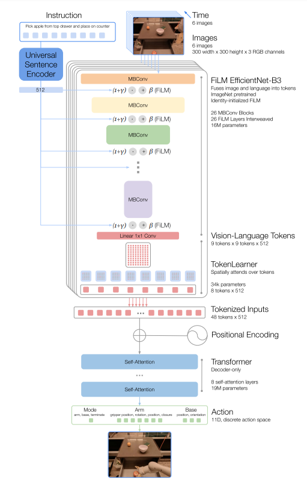

# Robotics Transformer-1

### Details

1. Embed texts by Universal Sentence Encoder, namely `text_cond`
2. Obtain features by `MBConv`
3. Do `FiLM` to integrate features and texts, i.e. $(1+Linear(text)*features+Linear(text))$
4. After passing through FiLM EfficientNet-B3, we get 81 tokens. Then compress tokens with `TokenLearner` (81 tokens -> 8 tokens)
5. Predict actions through `Transformer`
6. Mapping actions in 256 bins space

    

### Training Loss

1. Tokenize true actions
2. Compute cross-entropy of model output (logits) and tokenized true ations

### Predict  Actions

1. Select the last logit corresponding the last action
2. Argmax
3. Detokenize

