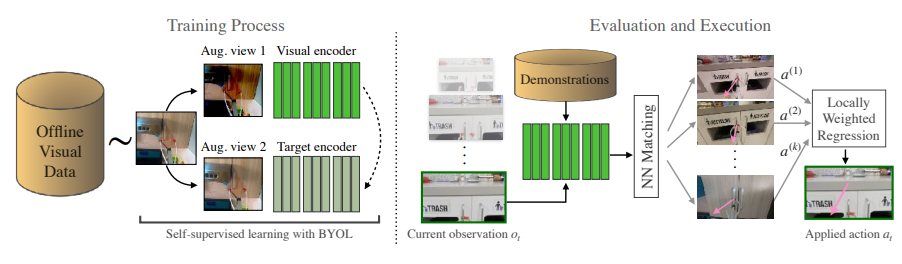
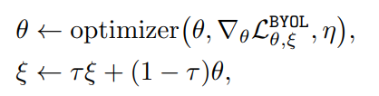

# Visual Imitation through Nearest Neighbors

<div align='center'>
    
</div>

## Training Process

<div align='center'>
    
</div>

The training strategy is based on BYOL, a kind of self-supervised learning strategy. Unlike other contrastive learning, it only enables the features between positive samples closer. (Only alignment loss, no uniformity loss).

- x is input image
- t, t’ are two different image transformation strategy.
- v, v’ are images after transformation.
- $f_{\theta},f_{\epsilon}$ are network with the same structure but different parameters.
- $y_{\theta},y_{\epsilon}$ are representation of v, v’.
- $g_{\theta},g_{\epsilon}$ are MLP.
- $q_{\theta}$ is linear layer.

$\theta,\epsilon$ updates in the following way below.

<div align='center'>
    
</div>

Here $f_{\theta},f_{\epsilon}$ are ResNet50. The input of the network is images, and output is its corresponding features.

The loss is simply MSE calculated with the output of the two similar networks.

## Evaluation Process

**Data:** trained ResNet50 model $f_{\theta}$, Demonstration data $D$, episode length $L$

1. Get a dataset storing observation features and corresponding action. $Dataset=f_{\theta}(D)$

**for** iteration t=1,2,...,L **do**

2. Sample a observation image
3. Calculate its neighbors

```python
def calculate_nearest_neighbors(query_img, dataset, k):
    query_embedding = encoder(query_img)
    for dataset_index in range(len(dataset)):
    dataset_embedding, dataset_translation = dataset[dataset_index]
    distance = dist_metric(query_embedding, dataset_embedding)
    dist_list.append((distance, dataset_translation, dataset_path))
    dist_list = sorted(dist_list, key = lambda tup: tup[0])
```

4. Calculate action by integrating all its neighbors

```python
def calculate_action(dist_list,k):
    action = torch.tensor([0.0,0.0,0.0])
    top_k_weights = torch.zeros((k,))
    for i in range(k):
    	top_k_weights[i] = dist_list[i][0]
    top_k_weights = softmax(-1*top_k_weights)
    for i in range(k):
        action = torch.add(top_k_weights[i] * dist_list[i][1], action)
    return(action)
```

5. Apply this action
