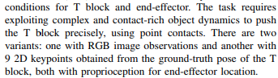
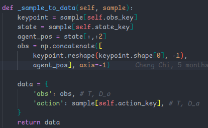
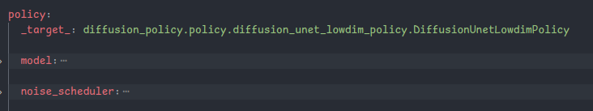
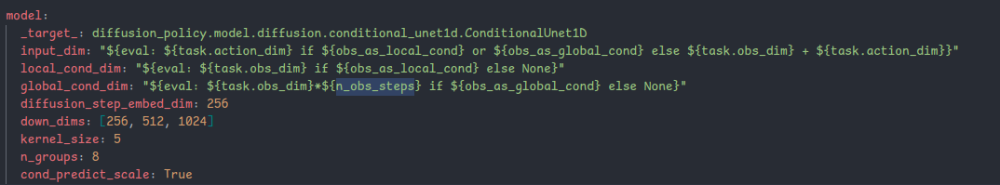
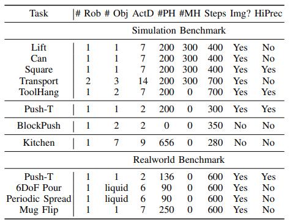
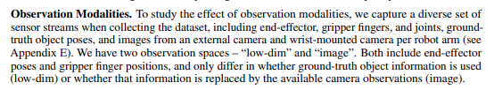
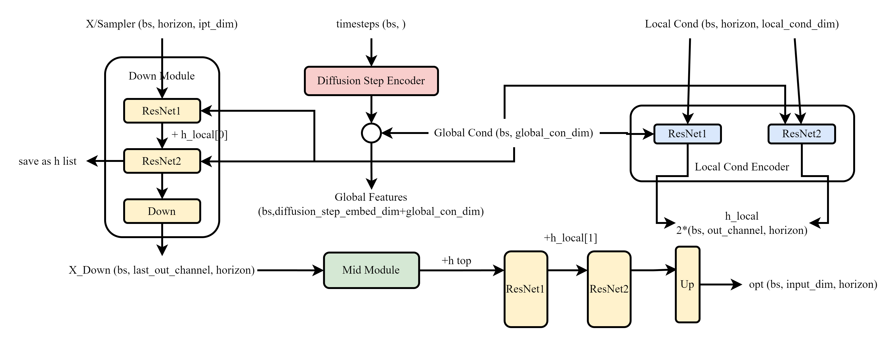
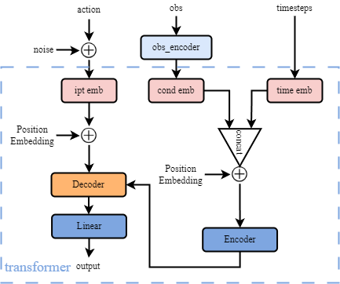

# Diffusion Policy

## Directory Structure

```
.
├── data # original data dir, and used for saving outputs
├── tests # env or functions testing
├── <font color='red'>diffusion_policy</font> # key dir
├── eval_real_robot.py # real env
├── multirun_metrics.py # compute metrics using logs
└── train.py # training file
```

**diffusion_policy**

```

├── codecs # images processing
├── common # utils
├── config # configuration dir
│   ├── defaults.yaml # configuration for workspace (defaults/overrides/policy/dataloader/opt/training/logging/checkpoint/hydra)
│   ├── task # configuration for task (env_runner/dataset/shape_meta[obs&acts description])
├── dataset # dataset class for per task
├── env # env class for per task (reset/step/render/_get_obs...)
├── env_runner # execute policy
├── gym_util # render issues
├── model # Neural Network Architecture
├── policy # predict actions/compute loss
├── real_world # real robot
├── scripts # buffer saving 
├── shared_memory # real robot
└── workspace # execute env_runner -> train/validation 
```

<font color='red' size=4>ReplayBuffer -> storing a demonstration dataset</font>


### PushT Task





**obs_dim (20)** -> 9\*2 keypoints + 2 state

**action_dim (2)**

### Policy (Diffusion Unit Low Dim Policy)

```python
def conditional_sample(**kwargs) # used for inference
def predict_action(**kwargs) # predict actions with `conditaional_sample`
```



### Network Achitecture



```python
"""
x: (B,T,input_dim)
timestep: (B,) or int, diffusion step
local_cond: (B,T,local_cond_dim)
global_cond: (B,global_cond_dim)
output: (B,T,input_dim)
"""
# diffusion_step_encoder
# if local_cond -> local_cond_encoder else none
# down_modules
# up_modules
# final_conv
```

### How to Train (workspace.run)


### Dataset

**diffusion_policy/dataset/**

```
├── base_dataset.py
├── blockpush_lowdim_dataset.py
├── kitchen_lowdim_dataset.py
├── kitchen_mjl_lowdim_dataset.py
├── pusht_dataset.py
├── pusht_image_dataset.py
├── real_pusht_image_dataset.py
├── robomimic_replay_image_dataset.py
└── robomimic_replay_lowdim_dataset.py
```

**base_dataset: **includes class `BaseLowdimDataset` and class `BaseImageDataset`, there are closely the same. 

| pusht_image_dataset                          | pusht_dataset                                |
| -------------------------------------------- | -------------------------------------------- |
| ReplayBuffer -> img, state, action           | ReplayBuffer -> keypoint, state, action      |
| obs -> image(T, 3, 96, 96) + agent_pos(T, 2) | obs -> cat(kpoint(T, 9, 2), agent_pos(T, 2)) |

**Original Data (`__name__.zarr`)** <font color='red'>Load by ReplayBuffer</font>

```tex
$ lowdim push T/2D without image input $
 ├── data
 │   ├── action (25650, 2) float32
 │   ├── img (25650, 96, 96, 3) float32
 │   ├── keypoint (25650, 9, 2) float32
 │   ├── n_contacts (25650, 1) float32
 │   └── state (25650, 5) float32
 └── meta
     └── episode_ends (206,) int64 -> start & end
```

**Training Data**

```tex
$ lowdim push T/2D without image input $
- obs		torch.Size([bs, horizon, 20])
- action	torch.Size([bs, horizon, 2])

$ image push T $
- obs		torch.Size([bs, horizon, channels, h, w])
- agent_pos	torch.Size([bs, horizon, 2])
- action	torch.Size([bs, horizon, 2])

$ block push $
- obs		torch.Size([bs, horizon, 16])
- action	torch.Size([bs, horizon, 2])
```

### Action Space and Observation Space

**Tasks:**





> - **Lift:**
>   - Observation Space (10 dim), includes cube position(3), cube quaternion(7), and cube position relative to the robot end effector(3).
>   - Action Space (7 dim), includes desired translation of EEF(3), desired delta rotation from current EEF(3), and opening and closing of the gripper fingers.
> - **Can:**
>   - Observation Space (14 dim), includes absolute Can position and quaternion(7), Can position and quaternion relative to the EEF(7)
>   - Action Space (7 dim), the same
> - **Square:**
>   - Observation Space (14 dim), the same as Can, but here is square nut
>   - Action Space (7 dim), the same
> - **Transport:**
>   - Observation Space (41 dim), includes absolution position and quaternion of hammer(7), absolute pos and quat of the trash cube(7), absolute pos and quat of lid handle(7), target bin position(3), trash bin position(3), the relative pos of the hammer and trash cube with respect to the 1st and 2nd EEF(12), a binary indicator for the hammer reaching the target bin(1), a binary indicator for the trash reaching the trash bin(1)
>   - Action Space (14 dim), double
> - **Tool Hang:**
>   - Observation Space (44 dim), includes the absolute position and quaternion and relative pose and quaternion with respect to the end effector of the base frame (14-dim), the insertion hook (14-dim), and the ratcheting wrench (14-dim), as well as binary indicators for whether the stand was assembled (1-dim) and whether the tool was successfully placed on the stand (1-dim)
>   - Action Space (7 dim), the same
> - **Push-T:**
>   - Observation Space (3, 96, 96), i.e. the camera image
>   - Action Space (2), agent 2D position
> - **BlockPush:**
>   - Observation Space (16), includes
>   - Action Space (2), the same as Push-T
> - **Kitchen:**
>   - Observation Space (30 dim), includes 7 objects positions
>   - Action Space (8 dim), includes 6 DoF for the arm and 2 for the gripper.
> - **Real Pour:**
>   - Observation Space (2, 3, 320, 340)
>   - Action Space (6 dim), 6 DoF


## Algorithm

### :point_down:Data Sampling Algorithm

```tex
# pad_before + episode_length + pad_after
# min_start -> -pad_before
# max_start -> episode_length - sequence_lenth + pad_after
$ indices -> [ts - horizon * len(episode_ends), 4] $
```

Sample sequences like this is more reasonable.

### Model
- Conditional Unet 1D

- For UNET, this is how it obtain local_cond or global_cond

```python
if self.obs_as_local_cond:
    # condition through local feature
    # all zero except first To timesteps
    local_cond = torch.zeros(size=(B,T,Do), device=device, dtype=dtype)
    local_cond[:,:To] = nobs[:,:To]
    shape = (B, T, Da)
    cond_data = torch.zeros(size=shape, device=device, dtype=dtype)
    cond_mask = torch.zeros_like(cond_data, dtype=torch.bool)
elif self.obs_as_global_cond:
    # condition throught global feature
    global_cond = nobs[:,:To].reshape(nobs.shape[0], -1)
    shape = (B, T, Da)
    if self.pred_action_steps_only:
        shape = (B, self.n_action_steps, Da)
    cond_data = torch.zeros(size=shape, device=device, dtype=dtype)
    cond_mask = torch.zeros_like(cond_data, dtype=torch.bool)
else:
    # condition through impainting
    shape = (B, T, Da+Do)
    cond_data = torch.zeros(size=shape, device=device, dtype=dtype)
    cond_mask = torch.zeros_like(cond_data, dtype=torch.bool)
    cond_data[:,:To,Da:] = nobs[:,:To]
    cond_mask[:,:To,Da:] = True
```

**Module Details**
```python
# Diffusion Step Encoder
diffusion_step_encoder = nn.Sequential(
    SinusoidalPosEmb(dsed),
    nn.Linear(dsed, dsed * 4),
    nn.Mish(),
    nn.Linear(dsed * 4, dsed),
)

# local_cond_encoder
local_cond_encoder = nn.ModuleList([
    # down encoder
    ConditionalResidualBlock1D
    # up encoder
    ConditionalResidualBlock1D
])

# Mid Modules
mid_modules = nn.ModuleList([
    ConditionalResidualBlock1D,
    ConditionalResidualBlock1D
])

# Down Modules
down_modules = nn.ModuleList([])
for ind, (dim_in, dim_out) in enumerate(in_out):
    down_modules.append(nn.ModuleList([
        ConditionalResidualBlock1D,
        ConditionalResidualBlock1D,
        Downsample1d(dim_out) if not is_last else nn.Identity()
    ]))

# Up Modules
up_modules = nn.ModuleList([])
for ind, (dim_in, dim_out) in enumerate(reversed(in_out[1:])):
    up_modules.append(nn.ModuleList([
        ConditionalResidualBlock1D,
        ConditionalResidualBlock1D,
        Upsample1d(dim_in) if not is_last else nn.Identity()
    ]))
```



**Transformer Module**


### Inference


## Experiments

Here is tricky thing, CNN or Unet1D does not pre-process the camera images, they use one class from robomimic package. And `obs_encoder` is the visual part. The implementation details are below.

```python
from robomimic.algo import algo_factory
from robomimic.algo.algo import PolicyAlgo
policy: PolicyAlgo = algo_factory(
        algo_name=config.algo_name,
        config=config,
        obs_key_shapes=obs_key_shapes,
        ac_dim=action_dim,
        device='cpu',
    )
obs_encoder = policy.nets['policy'].nets['encoder'].nets['obs']
print(policy)
'''
============= Initialized Observation Utils with Obs Spec =============

using obs modality: low_dim with keys: ['robot0_gripper_qpos', 'robot0_eef_pos', 'robot0_eef_quat']
using obs modality: rgb with keys: ['robot0_eye_in_hand_image', 'agentview_image']
using obs modality: depth with keys: []
using obs modality: scan with keys: []
ObservationKeyToModalityDict: mean not found, adding mean to mapping with assumed low_dim modality!
ObservationKeyToModalityDict: scale not found, adding scale to mapping with assumed low_dim modality!
ObservationKeyToModalityDict: logits not found, adding logits to mapping with assumed low_dim modality!
BC_RNN_GMM (
  ModuleDict(
    (policy): RNNGMMActorNetwork(
        action_dim=2, std_activation=softplus, low_noise_eval=True, num_nodes=5, min_std=0.0001
  
        encoder=ObservationGroupEncoder(
            group=obs
            ObservationEncoder(
                output_shape=[0]
            )
        )
  
        rnn=RNN_Base(
          (per_step_net): ObservationDecoder(
              Key(
                  name=mean
                  shape=(5, 2)
                  modality=low_dim
                  net=(Linear(in_features=1000, out_features=10, bias=True))
              )
              Key(
                  name=scale
                  shape=(5, 2)
                  modality=low_dim
                  net=(Linear(in_features=1000, out_features=10, bias=True))
              )
              Key(
                  name=logits
                  shape=(5,)
                  modality=low_dim
                  net=(Linear(in_features=1000, out_features=5, bias=True))
              )
          )
          (nets): LSTM(0, 1000, num_layers=2, batch_first=True)
        )
    )
  )
)

'''
```

**What is timestep?**

```python
class DDPMScheduler:
'''
Denoising Diffusion Probabilistic Models explores the connections between denoising score matching and Langevin dynamics sampling.

Args:
	num_train_timesteps ("int"): number of diffusion steps used to train the model.
	...
funs:
	set_timesteps: sets the discrete timesteps used for the diffusion chain. Supporting function to be run before inference
	Args:
		num_inference_steps ('int'): the number of diffusion steps used when generating samples with a pre-trained model
'''
timesteps = np.arange(0, num_train_timesteps, num_train_timesteps // num_inference_steps)[::-1]
```

## About Simulation Environment

### How does `Kitchen Task` create an environment?

```python
# kitchen_lowdim_runner.py, PATH: diffusion_policy/env_runner
from diffusion_policy.env.kitchen.v0 import KitchenAllv0
# v0.py, PATH: diffusion_policy/env/kitchen
from diffusion_policy.env.kitchen.base import KitchenBase
# base.py, PATH: diffusion_policy/env/kitchen
from adept_envs.franka.kitchen_multitask_v0 import KitchenTaskRelaxV1
# kitchen_multitask_v0.py, PATH: diffusion_policy/env/kitchen/relay_policy_learning/adept_envs/adept_envs/franka
from adept_envs import robot_env; from dm_control.mujoco import engine
# robot_env.py, PATH: diffusion_policy/env/kitchen/relay_policy_learning/adept_envs/adept_envs
from adept_envs import mujoco_env
# mujoco_env.py, PATH: diffusion_policy/env/kitchen/relay_policy_learning/adept_envs/adept_envs
from adept_envs.simulation.sim_robot import MujocoSimRobot, RenderMode
# sim_robot.py, PATH: diffusion_policy/env/kitchen/relay_policy_learning/adept_envs/adept_envs/simulation
class MujocoSimRobot:
"""class that encapsulates a Mojoco simulation

This class exposes methods that are agnostic to the simulation backend.
Two backends are qupported:
	1. mujoco_py - MuJoCo v1.50
	2. dm_control - MuJoCo v2.00
"""
```

### How does `Robomimic` load a simulation environment?

Here it uses robomimic package to make an environment(EnvRobosuite) from metadata, and actually it still uses mujoco_py to create its environment.


**Tasks can be implemented**

- [x] visual push-t
- [x] keypoints push-t

- [ ] block pushing (no vision) :no_entry_sign:

- [x] kitchen | being training -> mujoco
- [ ] robomimic (maybe)
  - [x] Lift
  - [x] Square
  - [ ] Can
- [x] <font color='red'>Do Transformer Exp</font>