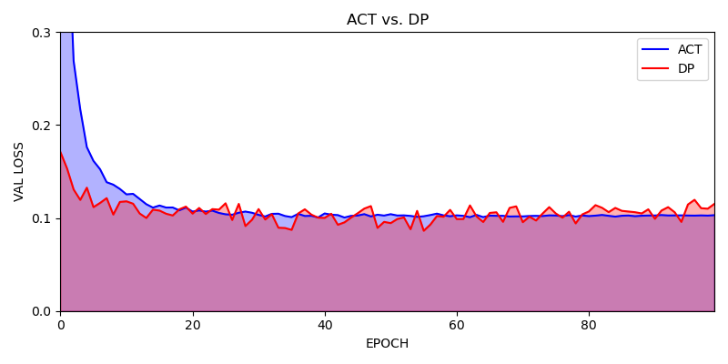

## Environment Settings

### ACT

| Hyperparams           | Value |
| --------------------- | ----- |
| learning rate         | 1e-5  |
| batch size            | 64    |
| encoder layer         | 6     |
| decoder layer         | 6     |
| feedforward dimension | 2048  |
| hidden dimension      | 512   |
| heads                 | 8     |
| dropout               | 0.1   |
| chunk size            | 10    |

### IBC

| Hyperparams   | Value                          |
| ------------- | ------------------------------ |
| learning rate | 1e-4                           |
| batch size    | 64                             |
| pred_n_iter   | the number of updating samples |

### DP

DDMP algorithm hyperparameters of policy, it can affect the denoising performance.

| name          | definition                                                   | value             |
| ------------- | ------------------------------------------------------------ | ----------------- |
| beta_start    | the starting beta value of inference                         | 0.0001            |
| beta_end      | the final beta value                                         | 0.02              |
| beta_schedule | the beta schedule, a mapping from a beta range to a sequence of betas for stepping the model | squaredcos_cap_v2 |

Task configuration of policy.

| name           | definition                                               | value |
| -------------- | -------------------------------------------------------- | ----- |
| horizon        | the step number of predicted action                      | 10    |
| n_action_steps | the step number of executing action                      | 8     |
| n_obs_steps    | the step number of obs that the model prediction depends | 2     |

Image processing of policy

| name       | definition                                | value |
| ---------- | ----------------------------------------- | ----- |
| crop_shape | the target image dimension after cropping | 10    |

Hyperparameters of model(transformer) that the policy uses.

| name        | definition                                     | value |
| ----------- | ---------------------------------------------- | ----- |
| n_layer     | the layer of decoder/encoder                   | 8     |
| n_head      | head number of multi-head attention            | 4     |
| n_emb       | embedding dimension                            | 256   |
| p_drop_emb  | drop prob of nn.Dropout before encoder/decoder | 0.0   |
| p_drop_attn | drop prob of nn.Dropout in transformer layer   | 0.3   |

EMA parameters.

| name      | definition                                  | value  |
| --------- | ------------------------------------------- | ------ |
| inv_gamma | inverse multiplicative factor of EMA warmup | 1.0    |
| power     | exponential factor of EMA warup             | 0.75   |
| min_value | the minimum EMA decay rate                  | 0.0    |
| max_value | the maximum EMA decay rate                  | 0.9999 |

dataloader：

| name        | definition                            | value |
| ----------- | ------------------------------------- | ----- |
| batch_size  | batch size                            | 64    |
| num_workers | number of processes when loading data | 8     |

optimizer:

| name                     | definition                                               | value       |
| ------------------------ | -------------------------------------------------------- | ----------- |
| transformer_weight_decay | transformer weight decay                                 | 1.0e-3      |
| obs_encoder_weight_decay | obs encoder weight decay                                 | 1.0e-6      |
| learning_rate            | learning rate                                            | 1.0e-4      |
| betas                    | decay rate of first-order moment and second-order moment | [0.9, 0.95] |

## TESTING INITIALIZATION

Use seeding reset method to initialize environment states.

```python
for i in range(n_test):
    seed = test_start_seed + i
    enable_render = i < n_test_vis

    def init_fn(env, seed=seed, 
        enable_render=enable_render):
        # setup rendering
        # video_wrapper
        assert isinstance(env.env, VideoRecordingWrapper)
        env.env.video_recoder.stop()
        env.env.file_path = None
        if enable_render:
            filename = pathlib.Path(output_dir).joinpath(
                'media', wv.util.generate_id() + ".mp4")
            filename.parent.mkdir(parents=False, exist_ok=True)
            filename = str(filename)
            env.env.file_path = filename

        # switch to seed reset
        assert isinstance(env.env.env, RobomimicImageWrapper)
        env.env.env.init_state = None
        env.seed(seed)

    env_seeds.append(seed)
    env_prefixs.append('test/')
    env_init_fn_dills.append(dill.dumps(init_fn))
```

Each epoch do one time of training loss calculation


Each epoch do one time of validation loss calculation



Every 5 epochs do one time of train action pred MSE calculation


|                         | ACT  | DP   | IBC  |
| ----------------------- | ---- | ---- | ---- |
| Success Rate (10 times) | 90%  | 70%  | 0%   |

**VIDEO DEMONSTRATION**

**DP SUCCESS**

<div align="center">
    
</div>


**DP FAILURE**

<div align="center">
    
</div>


**ACT SUCCESS**

<div align="center">
    
</div>


**ACT FAILURE**

<div align="center">
    
</div>


**IBC FAILURE**

<div align="center">
    
</div>

