# TRAINING

## TRAINING PARAMETERS SETTINGS

### Diffusion Policy

|             | name                     | definition                                                   | value             |
| ----------- | ------------------------ | ------------------------------------------------------------ | ----------------- |
| DDPM        | beta_start               | the starting beta value of inference                         | 0.0001            |
|             | beta_end                 | the final beta value                                         | 0.02              |
|             | beta_schedule            | the beta schedule, a mapping from a beta range to a sequence of betas for stepping the model | squaredcos_cap_v2 |
| task        | horizon                  | the step number of predicted action                          | 10                |
|             | n_action_steps           | the step number of executing action                          | 8                 |
|             | n_obs_steps              | the step number of obs that the model prediction depends     | 2                 |
|             | crop_shape               | the target image dimension after cropping                    | [76, 76]          |
| transformer | n_layer                  | the layer of decoder/encoder                                 | 8                 |
|             | n_head                   | head number of multi-head attention                          | 4                 |
|             | n_emb                    | embedding dimension                                          | 256               |
|             | p_drop_emb               | drop prob of nn.Dropout before encoder/decoder               | 0.0               |
|             | p_drop_attn              | drop prob of nn.Dropout in transformer layer                 | 0.3               |
| EMA         | inv_gamma                | inverse multiplicative factor of EMA warmup                  | 1.0               |
|             | power                    | exponential factor of EMA warup                              | 0.75              |
|             | min_value                | the minimum EMA decay rate                                   | 0.0               |
|             | max_value                | the maximum EMA decay rate                                   | 0.9999            |
| dataloader  | batch_size               | batch size                                                   | 64                |
| optimizer   | transformer_weight_decay | transformer weight decay                                     | 1.0e-3            |
|             | obs_encoder_weight_decay | obs encoder weight decay                                     | 1.0e-6            |
|             | learning_rate            | learning rate                                                | 1.0e-4            |
|             | betas                    | decay rate of first-order moment and second-order moment     | [0.9, 0.95]       |

### Action Chunk Transformer Policy

|             | name                  | definition                    | value |
| ----------- | --------------------- | ----------------------------- | ----- |
| optimizer   | learning rate         |                               | 1e-5  |
| dataloader  | batch size            |                               | 64    |
| transformer | encoder layer         | the number of encoder layers  | 6     |
|             | decoder layer         | the number of decoder layers  | 6     |
|             | feedforward dimension |                               | 2048  |
|             | hidden dimension      |                               | 512   |
|             | heads                 |                               | 8     |
|             | dropout               |                               | 0.1   |
| task        | chunk size            | the length of action sequence | 10    |

### Implicit Behavioral Cloning Policy

|            | name           | definition                                               | value         |
| ---------- | -------------- | -------------------------------------------------------- | ------------- |
| optimizer  | learning rate  |                                                          | 1e-4          |
|            | betas          |                                                          | [0.95, 0.999] |
|            | eps            |                                                          | 1.0e-8        |
|            | weight_decay   |                                                          | 1.0e-6        |
| dataloader | batch size     |                                                          | 64            |
| policy     | train_n_neg    | the number of negative samples                           | 100           |
|            | n_obs_steps    | the step number of obs that the model prediction depends | 2             |
|            | n_action_steps | the step number of executing action                      | 8             |
|            | horizon        | the step number of predicted action                      | 10            |
|            | crop_shape     | the target image dimension after cropping                | [76, 76]      |

## TRAINING RESULTS

- DP training loss: $k$ is diffusion timestep, $\epsilon^k$ denotes noise, $\epsilon_{\theta}$ denotes noise predictor, $A_t^O$ denotes original action.
  - $Loss = MSE(\epsilon^k, \epsilon_{\theta}(O_t, A_t^0+\epsilon^k,k))$
- ACT training loss: $q_{\phi}(z|a_{t:t+k},O_t)$ denotes encoder, $\pi_{\theta}(\widehat{a}_{t:t+k}|O_t,z)$ denotes decoder, weight $\beta$ 
  - $Loss=MSE(\pi_{\theta}(O_t, z),a_{t:t+k})+\beta D_{KL}(q_{\phi}(z|a_{t:t+k},O_t) || N(0,1))$
- IBC training loss: $E_{\theta}(O_t, A_t)$ denotes energy predictor

<div align="center">
    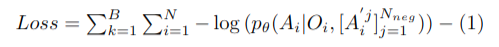
    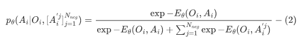
</div>

### :rocket: Square

#### Task description

The robot must pick a square nut and place it on a rod. Substantially more difficult than Lift and Pick Place Can due to the precision needed to pick up the nut and insert it on the rod.

#### Images

<div align="center">
    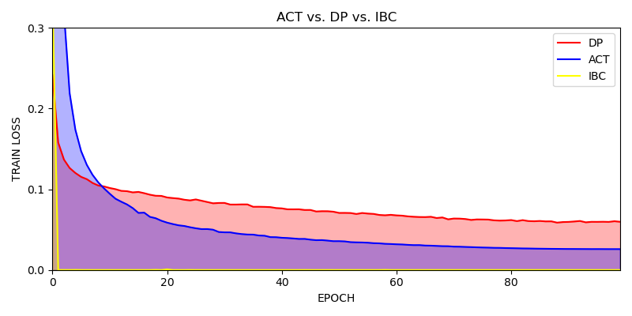
    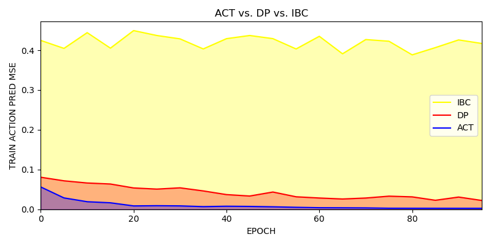
</div>


### :rocket: Can

#### Task description

The robot must place a coke can from a large bin into a smaller target bin. Slightly more challenging than Lift, since picking the can is harder than picking the cube, and the can must also be placed into the bin.

<div align="center">
    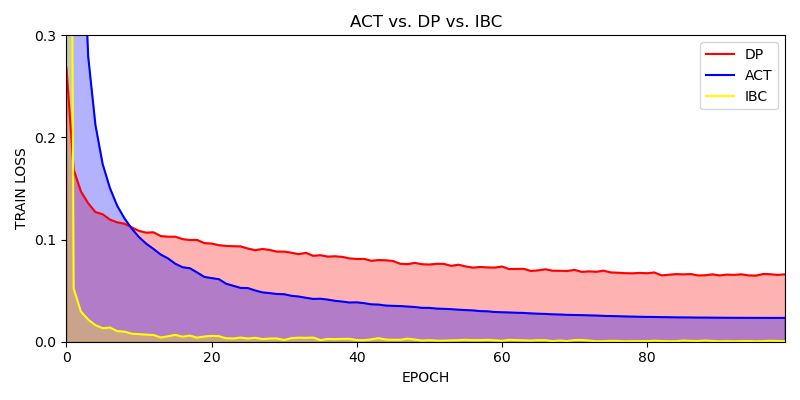
    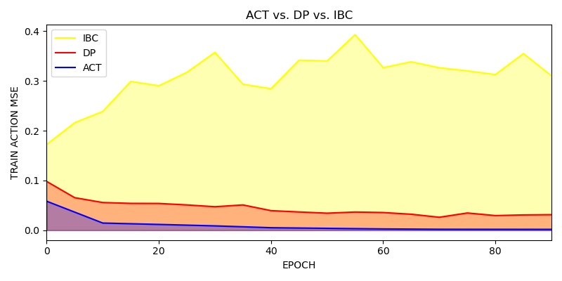
</div>

### :rocket: Push T

#### Task description

Require pushing a T-shaped block to a fixed target with a circular end-effector.

# INFERENCE

## TESTING DETAILS

> The type of controlling method is OSC-pose control.

### Initial State

Here `state` is a 45-dimension vector, i.e. time (1) + qpos (23) + qvel (21). We can directly set the environment a initial state we’ve designed previously. Or, do things below.

For `robot` initial pose, first we sample a fixed pose vector, i.e. [0, 0.19634954, 0, -2.61799388, 0, 2.94159265, 0.78539816]. Then we generate a random noise with a preset seed. Finally, we get the target pose by combine the fixed pose and the noise. The noise producing code is shown below.

```python
noise = np.random.randn(len(self.init_pos)) * self.initialization_noise['magnitude']
# the default value of initialization niose magnitude is 0.02
```

For `nut` initial pose, it is decided by a sampler class, but it has a x-y boundary. Actually, the environment has 2 types of nut, one called square, another called round. Their bound is specified below.

```python
# the same x range
x_range = [-0.115, -0.11]
# y range round | square
y_range = ([0.11, 0.225], [-0.225, -0.11])
```

### Testing Results

Every 5 epochs do one time of train action pred MSE calculation.

$MSE = \frac{1}{n} \sum_{i=1}^{n} (a_i - \hat{a}_i)^2$ Here, $a_i$ represents i-dim of original action, $\hat{a}_i$ denotes i-dim of predicted action.

### :rocket: Square

**Additional parameters in IBC when doing testing**

|           | name           | definition | value |
| --------- | -------------- | ---------- | ----- |
| optimizer | pred_n_iter    |            | 100   |
|           | pred_n_samples |            | 100   |


**SUCCESS RATE** Every 10 epochs do one time

<div align="center">
    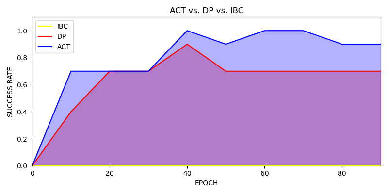
</div>

**VIDEO DEMONSTRATION**

**DP SUCCESS & FAILURE**

<div align="center">
    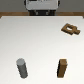
    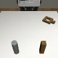
</div>

**ACT SUCCESS & FAILURE**

<div align="center">
    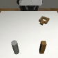
    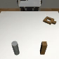
</div>

**IBC FAILURE**

<div align="center">
    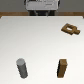
</div>


### :rocket: Can

**Additional parameters in IBC when doing testing**

|           | name           | definition | value |
| --------- | -------------- | ---------- | ----- |
| optimizer | pred_n_iter    |            | 100   |
|           | pred_n_samples |            | 100   |


**SUCCESS RATE** Every 10 epochs do one time

<div align="center">
    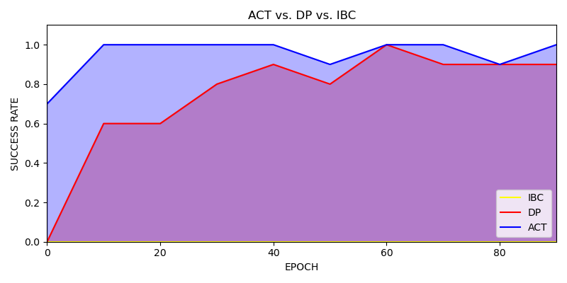
</div>


### :rocket: Push T


