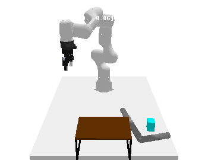
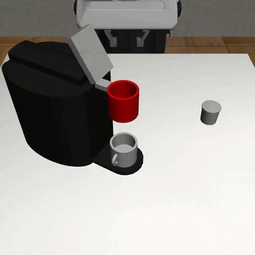
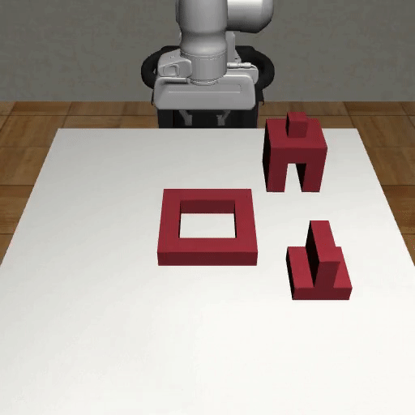
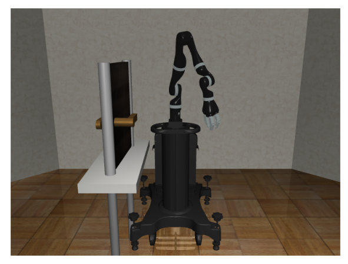
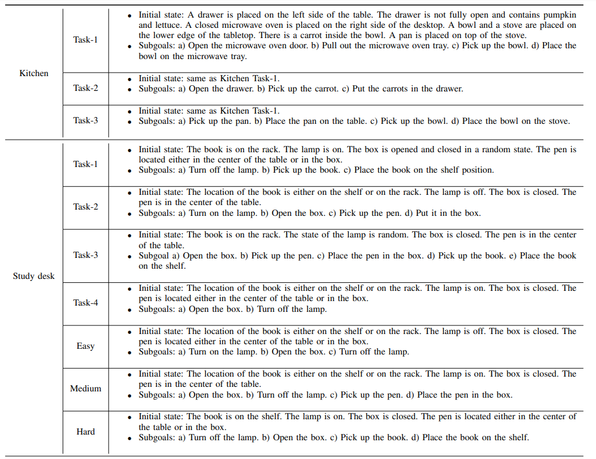
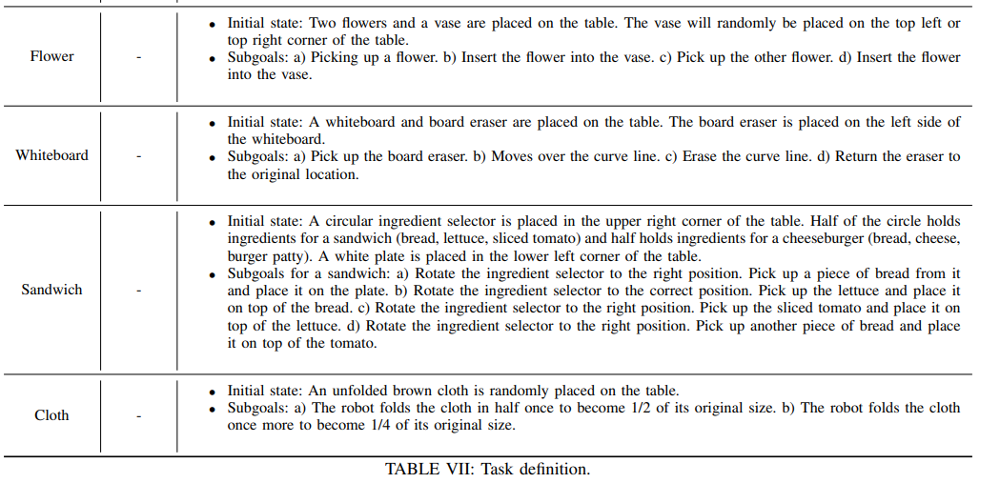

# Task Description

## Rearrange

    

## Use tool to pull and push a block into a target place

    

## Coffee

    

## 3 Items Assembly

    

## Tool Hang

    

## Coffee Prep

    

## Door Open

    

## Occlusion Grasp

    

## Placing

    

## Others

    
    
    

<a href='https://ut-austin-rpl.github.io/deoxys-docs/html/project.html'>使用spacemouse的研究</a>

<a href='https://ut-austin-rpl.github.io/deoxys-docs/html/tutorials/using_teleoperation_devices.html'>继承robosuite的spacemouse控制代码</a>
